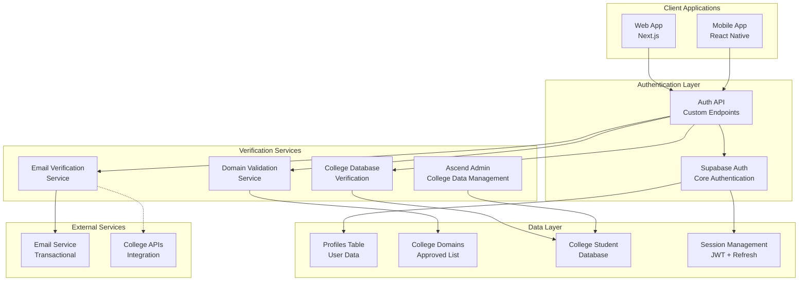

# Authentication Flow Design Document

## Overview

The Authentication Flow system is designed as a multi-layered verification architecture that ensures student-only access while providing an exceptional user experience. The system integrates with Supabase Auth for core authentication functionality while extending it with custom college verification logic, alternative verification methods, and comprehensive session management. The design prioritizes security, accessibility, and student-first user experience while maintaining scalability and compliance with privacy regulations.

## Architecture

### System Architecture Overview



### Authentication Flow Architecture

The authentication system follows a layered approach with clear separation of concerns:

1. **Presentation Layer**: Mobile and web clients handle user interactions
2. **API Layer**: Custom authentication endpoints extend Supabase Auth
3. **Service Layer**: Specialized services for different verification methods
4. **Data Layer**: Secure storage with Row Level Security (RLS)
5. **Integration Layer**: External services for email and college systems

## Components and Interfaces

### Core Authentication Components

#### 1. Authentication API Controller
```typescript
interface AuthController {
  // Primary email verification flow
  initiateEmailVerification(email: string, role: UserRole): Promise<VerificationResponse>;
  verifyEmailCode(email: string, code: string): Promise<AuthResponse>;
  resendVerificationCode(email: string): Promise<VerificationResponse>;
  
  // Alternative college database verification
  initiateCollegeVerification(collegeId: string): Promise<CollegeVerificationForm>;
  verifyCollegeCredentials(credentials: CollegeCredentials): Promise<AuthResponse>;
  
  // Session management
  refreshToken(refreshToken: string): Promise<TokenResponse>;
  logout(userId: string): Promise<void>;
  
  // Admin functions
  addCollegeDomain(domain: CollegeDomain): Promise<void>;
  uploadCollegeStudentData(collegeId: string, students: StudentRecord[]): Promise<void>;
}
```

#### 2. Email Verification Service
```typescript
interface EmailVerificationService {
  validateDomain(email: string): Promise<DomainValidationResult>;
  sendVerificationCode(email: string, code: string): Promise<EmailSendResult>;
  generateVerificationCode(): string;
  validateCode(email: string, code: string): Promise<boolean>;
  cleanupExpiredCodes(): Promise<void>;
}

interface DomainValidationResult {
  isValid: boolean;
  college: College | null;
  requiresManualReview: boolean;
  reason?: string;
}
```

#### 3. College Database Verification Service
```typescript
interface CollegeDBVerificationService {
  verifyStudentCredentials(credentials: CollegeCredentials): Promise<VerificationResult>;
  markCredentialsAsUsed(studentId: string): Promise<void>;
  addStudentRecord(collegeId: string, student: StudentRecord): Promise<void>;
  bulkUploadStudents(collegeId: string, students: StudentRecord[]): Promise<BulkUploadResult>;
  expireGraduatedStudents(collegeId: string): Promise<void>;
}

interface CollegeCredentials {
  collegeId: string;
  studentName: string;
  branch: string;
  year: number;
  verificationPassword: string;
  rollNumber?: string;
}
```

#### 4. Session Management Service
```typescript
interface SessionService {
  createSession(userId: string, deviceInfo: DeviceInfo): Promise<SessionTokens>;
  refreshSession(refreshToken: string): Promise<SessionTokens>;
  validateSession(accessToken: string): Promise<SessionValidation>;
  revokeSession(sessionId: string): Promise<void>;
  revokeAllUserSessions(userId: string): Promise<void>;
  detectSuspiciousActivity(userId: string, activity: ActivityLog): Promise<SecurityAction>;
}

interface SessionTokens {
  accessToken: string;
  refreshToken: string;
  expiresAt: Date;
  refreshExpiresAt: Date;
}
```

### User Interface Components

#### 1. Authentication Screens (Mobile)
```typescript
// Core authentication screens
interface AuthScreens {
  WelcomeScreen: React.FC<WelcomeScreenProps>;
  RoleSelectionScreen: React.FC<RoleSelectionProps>;
  EmailVerificationScreen: React.FC<EmailVerificationProps>;
  CollegeSelectionScreen: React.FC<CollegeSelectionProps>;
  CollegeCredentialsScreen: React.FC<CollegeCredentialsProps>;
  VerificationSuccessScreen: React.FC<SuccessScreenProps>;
}

interface EmailVerificationProps {
  onCodeSubmit: (code: string) => Promise<void>;
  onResendCode: () => Promise<void>;
  email: string;
  isLoading: boolean;
  error?: string;
  attemptsRemaining: number;
}
```

#### 2. Authentication Forms (Web)
```typescript
interface AuthForms {
  EmailVerificationForm: React.FC<EmailFormProps>;
  CollegeCredentialsForm: React.FC<CredentialsFormProps>;
  DomainRequestForm: React.FC<DomainRequestProps>;
}

interface EmailFormProps {
  onSubmit: (email: string) => Promise<void>;
  supportedDomains: string[];
  isLoading: boolean;
  validationErrors: ValidationError[];
}
```

### Integration Interfaces

#### 1. Supabase Auth Integration
```typescript
interface SupabaseAuthIntegration {
  createUser(email: string, password: string, metadata: UserMetadata): Promise<User>;
  signInUser(email: string, password: string): Promise<AuthResponse>;
  updateUserMetadata(userId: string, metadata: Partial<UserMetadata>): Promise<void>;
  deleteUser(userId: string): Promise<void>;
}

interface UserMetadata {
  role: UserRole;
  verificationStatus: VerificationStatus;
  verificationMethod: VerificationMethod;
  collegeId?: string;
  collegeDatabaseId?: string;
}
```

#### 2. Email Service Integration
```typescript
interface EmailServiceIntegration {
  sendVerificationEmail(to: string, code: string, college: College): Promise<EmailResult>;
  sendWelcomeEmail(to: string, user: User): Promise<EmailResult>;
  sendSecurityAlert(to: string, activity: SecurityActivity): Promise<EmailResult>;
}
```

## Data Models

### Core Data Structures

#### 1. User Profile Model
```sql
CREATE TABLE profiles (
  id UUID REFERENCES auth.users PRIMARY KEY,
  email TEXT UNIQUE, -- Nullable for college database verification
  name TEXT NOT NULL,
  bio TEXT,
  avatar_url TEXT,
  role user_role NOT NULL DEFAULT 'student',
  college_id UUID REFERENCES guilds(id),
  graduation_year INTEGER,
  verification_status verification_status DEFAULT 'pending',
  verification_method verification_method DEFAULT 'email',
  college_database_id UUID REFERENCES college_student_database(id),
  skills JSONB DEFAULT '[]',
  created_at TIMESTAMPTZ DEFAULT NOW(),
  updated_at TIMESTAMPTZ DEFAULT NOW(),
  last_login TIMESTAMPTZ,
  login_count INTEGER DEFAULT 0
);

CREATE TYPE user_role AS ENUM ('student', 'aspirant', 'guild_admin', 'platform_admin');
CREATE TYPE verification_status AS ENUM ('pending', 'verified', 'rejected', 'suspended');
CREATE TYPE verification_method AS ENUM ('email', 'college_database', 'manual');
```

#### 2. College Domains Model
```sql
CREATE TABLE college_domains (
  id UUID DEFAULT gen_random_uuid() PRIMARY KEY,
  domain TEXT UNIQUE, -- Nullable for colleges without email
  college_name TEXT NOT NULL,
  country TEXT NOT NULL,
  verification_type domain_verification_type DEFAULT 'automatic',
  provides_email BOOLEAN DEFAULT TRUE,
  is_active BOOLEAN DEFAULT TRUE,
  manual_review_required BOOLEAN DEFAULT FALSE,
  created_at TIMESTAMPTZ DEFAULT NOW(),
  verified_at TIMESTAMPTZ,
  verified_by UUID REFERENCES profiles(id)
);

CREATE TYPE domain_verification_type AS ENUM ('automatic', 'manual', 'suspended', 'database_only');
```

#### 3. College Student Database Model
```sql
CREATE TABLE college_student_database (
  id UUID DEFAULT gen_random_uuid() PRIMARY KEY,
  college_id UUID REFERENCES guilds(id) NOT NULL,
  student_name TEXT NOT NULL,
  branch TEXT NOT NULL,
  year INTEGER NOT NULL,
  roll_number TEXT,
  verification_password TEXT NOT NULL, -- Hashed with bcrypt
  is_active BOOLEAN DEFAULT TRUE,
  created_at TIMESTAMPTZ DEFAULT NOW(),
  expires_at TIMESTAMPTZ, -- For graduated students
  used_at TIMESTAMPTZ, -- When student created account
  used_by UUID REFERENCES profiles(id),
  
  -- Ensure uniqueness per college
  UNIQUE(college_id, student_name, branch, year),
  UNIQUE(college_id, verification_password)
);
```

#### 4. Email Verification Model
```sql
CREATE TABLE email_verifications (
  id UUID DEFAULT gen_random_uuid() PRIMARY KEY,
  email TEXT NOT NULL,
  code TEXT NOT NULL,
  attempts INTEGER DEFAULT 0,
  max_attempts INTEGER DEFAULT 3,
  created_at TIMESTAMPTZ DEFAULT NOW(),
  expires_at TIMESTAMPTZ DEFAULT (NOW() + INTERVAL '15 minutes'),
  verified_at TIMESTAMPTZ,
  ip_address INET,
  user_agent TEXT
);

CREATE INDEX idx_email_verifications_email ON email_verifications(email);
CREATE INDEX idx_email_verifications_expires ON email_verifications(expires_at);
```

#### 5. Session Management Model
```sql
CREATE TABLE user_sessions (
  id UUID DEFAULT gen_random_uuid() PRIMARY KEY,
  user_id UUID REFERENCES profiles(id) NOT NULL,
  refresh_token_hash TEXT NOT NULL,
  device_info JSONB,
  ip_address INET,
  user_agent TEXT,
  created_at TIMESTAMPTZ DEFAULT NOW(),
  expires_at TIMESTAMPTZ DEFAULT (NOW() + INTERVAL '30 days'),
  last_used TIMESTAMPTZ DEFAULT NOW(),
  is_active BOOLEAN DEFAULT TRUE
);

CREATE INDEX idx_user_sessions_user_id ON user_sessions(user_id);
CREATE INDEX idx_user_sessions_expires ON user_sessions(expires_at);
```

### Relationship Models

#### 1. College Data Management (MVP: Ascend-managed)

**MVP Strategy**: For rapid deployment and validation, Ascend will initially manage all college student databases directly. This approach allows us to:
- Quickly onboard colleges without requiring their technical infrastructure
- Maintain data quality and security standards
- Validate the verification system before scaling
- Build relationships with colleges before transitioning to self-management

**Future Transition**: Once the system is proven and scaled, we will transition to college-managed databases where each college maintains their own student data.
```sql
-- MVP: Ascend admins manage college data directly
-- Future: Transition to college-managed system
CREATE TABLE college_data_uploads (
  id UUID DEFAULT gen_random_uuid() PRIMARY KEY,
  college_id UUID REFERENCES guilds(id) NOT NULL,
  uploaded_by UUID REFERENCES profiles(id) NOT NULL, -- Ascend admin
  file_name TEXT NOT NULL,
  records_count INTEGER NOT NULL,
  upload_status TEXT DEFAULT 'processing',
  created_at TIMESTAMPTZ DEFAULT NOW(),
  processed_at TIMESTAMPTZ
);

-- Future enhancement: College admin management
CREATE TABLE college_admins (
  id UUID DEFAULT gen_random_uuid() PRIMARY KEY,
  college_id UUID REFERENCES guilds(id) NOT NULL,
  admin_email TEXT NOT NULL,
  admin_name TEXT NOT NULL,
  permissions JSONB DEFAULT '{"can_add_students": true, "can_remove_students": true, "can_view_analytics": true}',
  is_active BOOLEAN DEFAULT TRUE,
  created_at TIMESTAMPTZ DEFAULT NOW(),
  created_by UUID REFERENCES profiles(id),
  -- This table will be activated in future phases
  enabled BOOLEAN DEFAULT FALSE
);
```

#### 2. Audit Trail Model
```sql
CREATE TABLE auth_audit_log (
  id UUID DEFAULT gen_random_uuid() PRIMARY KEY,
  user_id UUID REFERENCES profiles(id),
  action TEXT NOT NULL,
  details JSONB,
  ip_address INET,
  user_agent TEXT,
  success BOOLEAN NOT NULL,
  created_at TIMESTAMPTZ DEFAULT NOW()
);

CREATE INDEX idx_auth_audit_user_id ON auth_audit_log(user_id);
CREATE INDEX idx_auth_audit_created_at ON auth_audit_log(created_at);
```

## Error Handling

### Error Classification System

#### 1. Validation Errors
```typescript
enum ValidationErrorCode {
  INVALID_EMAIL_FORMAT = 'INVALID_EMAIL_FORMAT',
  UNSUPPORTED_DOMAIN = 'UNSUPPORTED_DOMAIN',
  INVALID_VERIFICATION_CODE = 'INVALID_VERIFICATION_CODE',
  EXPIRED_VERIFICATION_CODE = 'EXPIRED_VERIFICATION_CODE',
  MISSING_REQUIRED_FIELD = 'MISSING_REQUIRED_FIELD',
  INVALID_COLLEGE_CREDENTIALS = 'INVALID_COLLEGE_CREDENTIALS'
}

interface ValidationError {
  code: ValidationErrorCode;
  message: string;
  field?: string;
  details?: any;
}
```

#### 2. Authentication Errors
```typescript
enum AuthErrorCode {
  VERIFICATION_ATTEMPTS_EXCEEDED = 'VERIFICATION_ATTEMPTS_EXCEEDED',
  CREDENTIALS_ALREADY_USED = 'CREDENTIALS_ALREADY_USED',
  STUDENT_NOT_FOUND = 'STUDENT_NOT_FOUND',
  INVALID_SESSION = 'INVALID_SESSION',
  SESSION_EXPIRED = 'SESSION_EXPIRED',
  SUSPICIOUS_ACTIVITY = 'SUSPICIOUS_ACTIVITY'
}
```

#### 3. System Errors
```typescript
enum SystemErrorCode {
  EMAIL_SEND_FAILED = 'EMAIL_SEND_FAILED',
  DATABASE_CONNECTION_ERROR = 'DATABASE_CONNECTION_ERROR',
  EXTERNAL_SERVICE_UNAVAILABLE = 'EXTERNAL_SERVICE_UNAVAILABLE',
  RATE_LIMIT_EXCEEDED = 'RATE_LIMIT_EXCEEDED'
}
```

### Error Recovery Strategies

#### 1. Automatic Recovery
- **Email Send Failures**: Retry with exponential backoff (3 attempts)
- **Database Timeouts**: Automatic retry with circuit breaker pattern
- **Network Issues**: Client-side retry with user notification

#### 2. User-Guided Recovery
- **Invalid Verification Code**: Clear guidance and immediate resend option
- **Unsupported Domain**: Domain request form with admin contact
- **Expired Sessions**: Seamless token refresh or guided re-authentication

#### 3. Fallback Mechanisms
- **Email Service Down**: Queue verification emails for later delivery
- **College Database Unavailable**: Fallback to manual verification process
- **Primary Authentication Failed**: Alternative verification methods

## Testing Strategy

### Unit Testing Approach

#### 1. Service Layer Testing
```typescript
describe('EmailVerificationService', () => {
  describe('validateDomain', () => {
    it('should validate approved college domains', async () => {
      const result = await emailService.validateDomain('student@iitdelhi.ac.in');
      expect(result.isValid).toBe(true);
      expect(result.college).toBeDefined();
    });
    
    it('should reject non-educational domains', async () => {
      const result = await emailService.validateDomain('user@gmail.com');
      expect(result.isValid).toBe(false);
      expect(result.reason).toContain('not an approved college domain');
    });
  });
});
```

#### 2. Database Testing
```typescript
describe('College Database Verification', () => {
  it('should verify valid student credentials', async () => {
    const credentials = {
      collegeId: 'test-college-id',
      studentName: 'John Doe',
      branch: 'Computer Science',
      year: 2024,
      verificationPassword: 'test-password'
    };
    
    const result = await collegeDBService.verifyStudentCredentials(credentials);
    expect(result.verified).toBe(true);
  });
});
```

### Integration Testing

#### 1. Authentication Flow Testing
```typescript
describe('Complete Authentication Flow', () => {
  it('should complete email verification flow', async () => {
    // Step 1: Initiate verification
    const initResponse = await request(app)
      .post('/api/v1/auth/verify-email')
      .send({ email: 'student@testcollege.edu' });
    
    expect(initResponse.status).toBe(200);
    
    // Step 2: Verify code
    const verifyResponse = await request(app)
      .post('/api/v1/auth/verify-code')
      .send({ 
        email: 'student@testcollege.edu',
        code: 'test-code'
      });
    
    expect(verifyResponse.status).toBe(200);
    expect(verifyResponse.body.tokens).toBeDefined();
  });
});
```

### End-to-End Testing

#### 1. User Journey Testing
- Complete signup flow from welcome to verified account
- Error handling scenarios with recovery paths
- Cross-platform consistency (mobile and web)
- Accessibility compliance testing

#### 2. Security Testing
- Token manipulation and validation
- Rate limiting effectiveness
- SQL injection prevention
- Cross-site scripting (XSS) protection

### Performance Testing

#### 1. Load Testing Scenarios
- Concurrent verification attempts during peak signup periods
- Email service capacity under high load
- Database performance with large college student datasets
- Session management scalability

#### 2. Performance Benchmarks
- Email verification: < 30 seconds end-to-end
- Code validation: < 500ms response time
- Token refresh: < 200ms response time
- Database verification: < 1 second response time

## Security Considerations

### Data Protection Measures

#### 1. Encryption Standards
- **At Rest**: AES-256 encryption for sensitive data
- **In Transit**: TLS 1.3 for all communications
- **Password Hashing**: bcrypt with salt rounds ≥ 12
- **Token Security**: JWT with RS256 signing

#### 2. Access Control
- **Row Level Security**: Supabase RLS policies for data access
- **API Authentication**: Bearer token validation on all endpoints
- **Role-Based Permissions**: Granular access control by user role
- **Admin Functions**: Multi-factor authentication required

#### 3. Privacy Protection
- **Data Minimization**: Collect only necessary verification data
- **Retention Policies**: Automatic cleanup of expired verification codes
- **Anonymization**: Remove PII from audit logs after retention period
- **Consent Management**: Clear opt-in for data processing

### Security Monitoring

#### 1. Threat Detection
- **Brute Force Protection**: Rate limiting with progressive delays
- **Anomaly Detection**: Unusual login patterns and locations
- **Token Abuse**: Monitoring for token reuse and manipulation
- **Data Access Patterns**: Unusual database query patterns

#### 2. Incident Response
- **Automated Alerts**: Real-time notifications for security events
- **Session Revocation**: Immediate token invalidation for compromised accounts
- **Audit Trail**: Comprehensive logging for forensic analysis
- **Recovery Procedures**: Documented steps for security incidents

## Deployment Architecture

### Infrastructure Components

#### 1. Supabase Configuration
```typescript
// Supabase project configuration
const supabaseConfig = {
  url: process.env.SUPABASE_URL,
  anonKey: process.env.SUPABASE_ANON_KEY,
  serviceRoleKey: process.env.SUPABASE_SERVICE_ROLE_KEY,
  auth: {
    autoRefreshToken: true,
    persistSession: true,
    detectSessionInUrl: true
  }
};
```

#### 2. Edge Functions Deployment
```typescript
// Email verification edge function
export const emailVerificationFunction = async (req: Request) => {
  const { email, action } = await req.json();
  
  switch (action) {
    case 'send_code':
      return await sendVerificationCode(email);
    case 'verify_code':
      return await verifyCode(email, code);
    default:
      return new Response('Invalid action', { status: 400 });
  }
};
```

#### 3. Database Migrations
```sql
-- Migration: 001_create_auth_tables.sql
BEGIN;

-- Enable necessary extensions
CREATE EXTENSION IF NOT EXISTS "uuid-ossp";
CREATE EXTENSION IF NOT EXISTS "pgcrypto";

-- Create custom types
CREATE TYPE user_role AS ENUM ('student', 'aspirant', 'guild_admin', 'platform_admin');
CREATE TYPE verification_status AS ENUM ('pending', 'verified', 'rejected', 'suspended');
CREATE TYPE verification_method AS ENUM ('email', 'college_database', 'manual');

-- Create tables
CREATE TABLE college_domains (...);
CREATE TABLE college_student_database (...);
CREATE TABLE email_verifications (...);
CREATE TABLE user_sessions (...);

-- Create indexes
CREATE INDEX idx_email_verifications_email ON email_verifications(email);
CREATE INDEX idx_user_sessions_user_id ON user_sessions(user_id);

-- Enable RLS
ALTER TABLE college_domains ENABLE ROW LEVEL SECURITY;
ALTER TABLE college_student_database ENABLE ROW LEVEL SECURITY;
ALTER TABLE email_verifications ENABLE ROW LEVEL SECURITY;
ALTER TABLE user_sessions ENABLE ROW LEVEL SECURITY;

-- Create RLS policies
CREATE POLICY "Public can view active college domains" ON college_domains
  FOR SELECT USING (is_active = true);

CREATE POLICY "Users can manage their own sessions" ON user_sessions
  FOR ALL USING (user_id = auth.uid());

COMMIT;
```

### Environment Configuration

#### 1. Development Environment
```env
# Supabase Configuration
SUPABASE_URL=https://your-project.supabase.co
SUPABASE_ANON_KEY=your-anon-key
SUPABASE_SERVICE_ROLE_KEY=your-service-role-key

# Email Service
EMAIL_SERVICE_API_KEY=your-email-service-key
EMAIL_FROM_ADDRESS=noreply@ascend.com

# Security
JWT_SECRET=your-jwt-secret
BCRYPT_ROUNDS=12

# Rate Limiting
RATE_LIMIT_WINDOW=900000  # 15 minutes
RATE_LIMIT_MAX_ATTEMPTS=5
```

#### 2. Production Environment
- Enhanced security configurations
- Monitoring and alerting setup
- Backup and disaster recovery
- Performance optimization settings

This comprehensive design document provides the foundation for implementing Ascend's authentication flow system with security, scalability, and user experience as primary considerations.