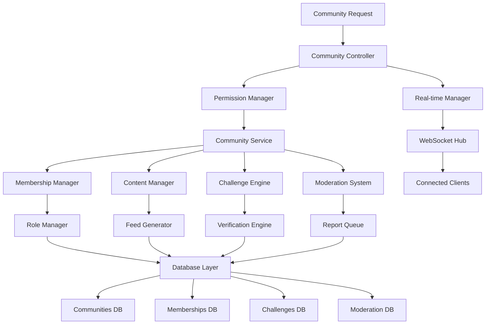
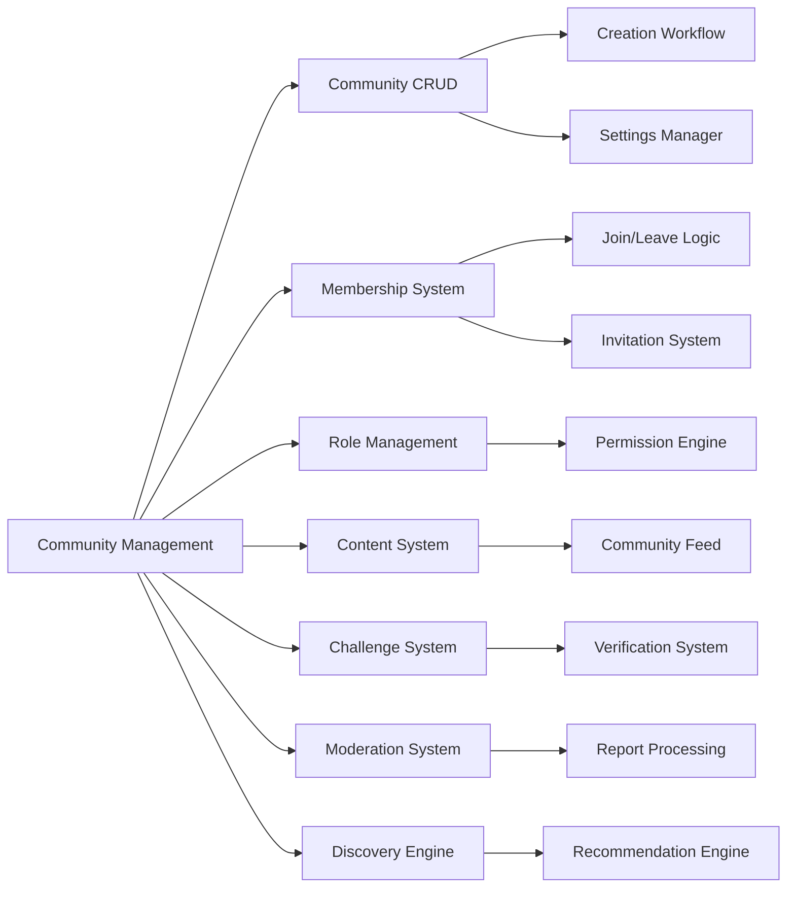

# Community Management System Design

## Overview

The Community Management System is designed as a comprehensive platform for creating, managing, and participating in topic-based communities that break down institutional barriers and foster meaningful cross-college connections. The system combines intelligent discovery, role-based governance, community-driven moderation, and skill-building challenges to create supportive learning environments where students can grow together across different colleges and academic disciplines.

## Architecture

### System Architecture Overview



### Component Architecture



## Components and Interfaces

### Core Components

#### 1. Community Controller
```typescript
interface CommunityController {
  createCommunity(communityData: CreateCommunityData): Promise<CommunityResponse>;
  getCommunity(communityId: string, userId: string): Promise<CommunityDetailResponse>;
  updateCommunity(communityId: string, updates: UpdateCommunityData): Promise<CommunityResponse>;
  deleteCommunity(communityId: string, userId: string): Promise<void>;
  searchCommunities(query: SearchQuery, userId: string): Promise<CommunitySearchResponse>;
}
```interface 
CreateCommunityData {
  name: string;
  description: string;
  topicCategory: TopicCategory;
  visibilityType: CommunityVisibility;
  contentGuidelines: string;
  moderationPolicy: string;
  allowChallenges: boolean;
  crossCollegeEnabled: boolean;
}

interface CommunityResponse {
  community: Community;
  userRole: CommunityRole;
  membershipStatus: MembershipStatus;
  permissions: CommunityPermissions;
}

#### 2. Membership Manager
```typescript
interface MembershipManager {
  joinCommunity(communityId: string, userId: string, joinData?: JoinRequestData): Promise<MembershipResponse>;
  leaveCommunity(communityId: string, userId: string): Promise<void>;
  approveMembership(communityId: string, userId: string, approverId: string): Promise<void>;
  removeMember(communityId: string, userId: string, removerId: string, reason: string): Promise<void>;
  inviteMembers(communityId: string, invitations: CommunityInvitation[]): Promise<InvitationResponse>;
}

interface JoinRequestData {
  applicationMessage?: string;
  invitationCode?: string;
  referredBy?: string;
}

interface CommunityInvitation {
  email?: string;
  userId?: string;
  message: string;
  expiresAt: Date;
}
```

#### 3. Role Management System
```typescript
interface RoleManager {
  assignRole(communityId: string, userId: string, role: CommunityRole, assignerId: string): Promise<void>;
  removeRole(communityId: string, userId: string, removerId: string): Promise<void>;
  checkPermission(communityId: string, userId: string, permission: CommunityPermission): Promise<boolean>;
  getUserPermissions(communityId: string, userId: string): Promise<CommunityPermissions>;
}

enum CommunityRole {
  MEMBER = 'member',
  MODERATOR = 'moderator',
  ADMIN = 'admin'
}

enum CommunityPermission {
  VIEW_CONTENT = 'view_content',
  POST_CONTENT = 'post_content',
  COMMENT_REACT = 'comment_react',
  DELETE_OWN_CONTENT = 'delete_own_content',
  DELETE_OTHERS_CONTENT = 'delete_others_content',
  REMOVE_MEMBERS = 'remove_members',
  PIN_POSTS = 'pin_posts',
  CREATE_CHALLENGES = 'create_challenges',
  MANAGE_MODERATION = 'manage_moderation',
  EDIT_COMMUNITY = 'edit_community',
  ASSIGN_MODERATORS = 'assign_moderators',
  DELETE_COMMUNITY = 'delete_community'
}
```

#### 4. Community Content Manager
```typescript
interface CommunityContentManager {
  createPost(postData: CommunityPostData): Promise<PostResponse>;
  getCommunityFeed(communityId: string, options: FeedOptions): Promise<CommunityFeedResponse>;
  pinPost(communityId: string, postId: string, userId: string): Promise<void>;
  unpinPost(communityId: string, postId: string, userId: string): Promise<void>;
  featureContent(communityId: string, postId: string, userId: string): Promise<void>;
}

interface CommunityPostData extends PostData {
  communityId: string;
  postType: CommunityPostType;
  challengeId?: string;
  resourceLinks?: string[];
  eventDetails?: EventDetails;
}

enum CommunityPostType {
  WIN = 'win',
  PROJECT_UPDATE = 'project_update',
  QUESTION = 'question',
  CHALLENGE_SUBMISSION = 'challenge_submission',
  RESOURCE_SHARE = 'resource_share',
  EVENT_ANNOUNCEMENT = 'event_announcement',
  DISCUSSION = 'discussion'
}

interface FeedOptions {
  sortBy: 'recent' | 'hot' | 'top' | 'pinned';
  timeRange?: 'day' | 'week' | 'month' | 'all';
  postTypes?: CommunityPostType[];
  limit: number;
  offset: number;
}
```

#### 5. Challenge System
```typescript
interface ChallengeManager {
  createChallenge(challengeData: CreateChallengeData): Promise<ChallengeResponse>;
  submitToChallenge(submissionData: ChallengeSubmissionData): Promise<SubmissionResponse>;
  evaluateSubmission(submissionId: string, evaluation: SubmissionEvaluation): Promise<void>;
  getChallengeResults(challengeId: string): Promise<ChallengeResultsResponse>;
}

interface CreateChallengeData {
  communityId: string;
  title: string;
  description: string;
  prompt: string;
  submissionGuidelines: string;
  evaluationCriteria: EvaluationCriteria[];
  deadline: Date;
  rewards: ChallengeReward[];
  skillsToVerify: string[];
  difficultyLevel: 'beginner' | 'intermediate' | 'advanced';
}

interface ChallengeSubmissionData {
  challengeId: string;
  userId: string;
  submissionContent: string;
  attachments: string[];
  selfAssessment: SelfAssessment;
  skillsClaimed: string[];
}

interface SubmissionEvaluation {
  evaluatorId: string;
  evaluatorType: 'peer' | 'moderator' | 'automated';
  scores: Record<string, number>;
  feedback: string;
  skillsVerified: string[];
  recommendedImprovements: string[];
}
```

## Data Models

### Community Model
```typescript
interface Community {
  id: string;
  name: string;
  description: string;
  topicCategory: TopicCategory;
  visibilityType: CommunityVisibility;
  createdBy: string;
  createdAt: Date;
  updatedAt: Date;
  
  // Management
  admins: string[];
  moderators: string[];
  memberCount: number;
  activeMembers: number;
  
  // Content
  contentGuidelines: string;
  moderationPolicy: string;
  allowedPostTypes: CommunityPostType[];
  
  // Features
  allowChallenges: boolean;
  crossCollegeEnabled: boolean;
  skillFocus: string[];
  
  // Metrics
  activityScore: number;
  diversityIndex: number;
  engagementRate: number;
  
  // Settings
  joinRequirements: JoinRequirements;
  contentApprovalRequired: boolean;
  challengePermissions: ChallengePermissions;
}

enum CommunityVisibility {
  PUBLIC = 'public',
  PRIVATE = 'private',
  INVITE_ONLY = 'invite_only',
  COLLEGE_SPECIFIC = 'college_specific'
}

enum TopicCategory {
  AI_ML = 'ai_ml',
  WEB_DEVELOPMENT = 'web_development',
  DATA_SCIENCE = 'data_science',
  MOBILE_DEVELOPMENT = 'mobile_development',
  DESIGN_UX = 'design_ux',
  FINANCE = 'finance',
  MARKETING = 'marketing',
  ENTREPRENEURSHIP = 'entrepreneurship',
  RESEARCH = 'research',
  CAREER_DEVELOPMENT = 'career_development'
}
```

### Membership Model
```typescript
interface CommunityMembership {
  id: string;
  communityId: string;
  userId: string;
  role: CommunityRole;
  joinedAt: Date;
  invitedBy?: string;
  
  // Status
  status: MembershipStatus;
  lastActive: Date;
  contributionScore: number;
  
  // Permissions
  customPermissions: CommunityPermission[];
  restrictedPermissions: CommunityPermission[];
  
  // Moderation
  warnings: ModerationWarning[];
  suspensions: ModerationSuspension[];
  
  // Engagement
  postsCreated: number;
  commentsPosted: number;
  challengesCompleted: number;
  helpfulContributions: number;
}

enum MembershipStatus {
  PENDING = 'pending',
  ACTIVE = 'active',
  SUSPENDED = 'suspended',
  BANNED = 'banned',
  LEFT = 'left'
}
```

### Challenge Model
```typescript
interface Challenge {
  id: string;
  communityId: string;
  createdBy: string;
  title: string;
  description: string;
  prompt: string;
  
  // Guidelines
  submissionGuidelines: string;
  evaluationCriteria: EvaluationCriteria[];
  
  // Timing
  createdAt: Date;
  startsAt: Date;
  deadline: Date;
  
  // Configuration
  difficultyLevel: 'beginner' | 'intermediate' | 'advanced';
  maxSubmissions: number;
  allowLateSubmissions: boolean;
  
  // Skills
  skillsToVerify: string[];
  prerequisiteSkills: string[];
  
  // Rewards
  rewards: ChallengeReward[];
  
  // Status
  status: ChallengeStatus;
  participantCount: number;
  submissionCount: number;
  completionRate: number;
}

interface EvaluationCriteria {
  name: string;
  description: string;
  weight: number;
  maxScore: number;
  rubric: string[];
}

interface ChallengeReward {
  type: 'badge' | 'skill_verification' | 'profile_boost' | 'community_recognition';
  name: string;
  description: string;
  criteria: string;
  value: number;
}

enum ChallengeStatus {
  DRAFT = 'draft',
  PUBLISHED = 'published',
  ACTIVE = 'active',
  EVALUATION = 'evaluation',
  COMPLETED = 'completed',
  CANCELLED = 'cancelled'
}
```

### Moderation Model
```typescript
interface ModerationReport {
  id: string;
  communityId: string;
  reportedBy: string;
  reportedContent: {
    type: 'post' | 'comment' | 'user' | 'challenge';
    id: string;
    content: string;
  };
  
  // Report Details
  violationType: ViolationType;
  description: string;
  evidence: string[];
  isAnonymous: boolean;
  
  // Processing
  status: ReportStatus;
  assignedTo?: string;
  reviewedAt?: Date;
  resolution?: ModerationResolution;
  
  // Priority
  priorityScore: number;
  urgencyLevel: 'low' | 'medium' | 'high' | 'critical';
  
  createdAt: Date;
}

enum ViolationType {
  SPAM = 'spam',
  HARASSMENT = 'harassment',
  INAPPROPRIATE_CONTENT = 'inappropriate_content',
  MISINFORMATION = 'misinformation',
  GUIDELINE_VIOLATION = 'guideline_violation',
  ACADEMIC_DISHONESTY = 'academic_dishonesty'
}

enum ReportStatus {
  PENDING = 'pending',
  IN_REVIEW = 'in_review',
  RESOLVED = 'resolved',
  DISMISSED = 'dismissed',
  ESCALATED = 'escalated'
}

interface ModerationResolution {
  action: ModerationAction;
  reason: string;
  moderatorId: string;
  appealable: boolean;
  appealDeadline?: Date;
  additionalNotes?: string;
}

enum ModerationAction {
  DISMISS_REPORT = 'dismiss_report',
  REMOVE_CONTENT = 'remove_content',
  REMOVE_CONTENT_WARNING = 'remove_content_warning',
  TEMPORARY_SUSPENSION = 'temporary_suspension',
  PERMANENT_BAN = 'permanent_ban',
  REQUIRE_EDIT = 'require_edit'
}
```

## User Experience Design

### Campus Confidence Integration

#### Community Onboarding Experience
```typescript
interface CommunityOnboarding {
  welcomeMessage: string;
  communityTour: OnboardingStep[];
  introductionPrompts: string[];
  firstContributionSuggestions: ContributionSuggestion[];
  mentorAssignment?: MentorAssignment;
}

interface OnboardingStep {
  title: string;
  description: string;
  action: string;
  completionCriteria: string;
  celebrationMessage: string;
}

interface ContributionSuggestion {
  type: 'post' | 'comment' | 'challenge_participation';
  title: string;
  description: string;
  difficulty: 'easy' | 'medium' | 'challenging';
  estimatedTime: string;
  skillsInvolved: string[];
}
```

#### Achievement and Recognition System
```typescript
interface CommunityAchievement {
  id: string;
  name: string;
  description: string;
  type: AchievementType;
  criteria: AchievementCriteria;
  reward: AchievementReward;
  rarity: 'common' | 'uncommon' | 'rare' | 'legendary';
  
  // Visual
  iconUrl: string;
  badgeColor: string;
  celebrationAnimation: string;
}

enum AchievementType {
  FIRST_POST = 'first_post',
  HELPFUL_CONTRIBUTOR = 'helpful_contributor',
  CHALLENGE_WINNER = 'challenge_winner',
  COMMUNITY_BUILDER = 'community_builder',
  CROSS_COLLEGE_CONNECTOR = 'cross_college_connector',
  SKILL_MENTOR = 'skill_mentor'
}
```

### Accessibility Features

#### Inclusive Community Design
```typescript
interface AccessibilityFeatures {
  screenReaderSupport: {
    communityDescriptions: string;
    roleAnnouncements: string;
    challengeInstructions: string;
    moderationFeedback: string;
  };
  
  keyboardNavigation: {
    communityBrowsing: KeyboardShortcut[];
    contentCreation: KeyboardShortcut[];
    moderationActions: KeyboardShortcut[];
  };
  
  visualAccessibility: {
    highContrastMode: boolean;
    customColorSchemes: ColorScheme[];
    textSizeOptions: TextSizeOption[];
  };
  
  cognitiveSupport: {
    simplifiedInterface: boolean;
    guidedWorkflows: boolean;
    progressIndicators: boolean;
    timeExtensions: boolean;
  };
}
```

## Real-time Features Implementation

### Community Activity Streams
```typescript
class CommunityRealtimeManager {
  private connections = new Map<string, Set<string>>();
  
  subscribeToCommunityUpdates(communityId: string, userId: string): void {
    const channel = `community:${communityId}`;
    
    if (!this.connections.has(channel)) {
      this.connections.set(channel, new Set());
    }
    
    this.connections.get(channel)!.add(userId);
    
    // Subscribe to Supabase real-time
    const subscription = supabase
      .channel(channel)
      .on('postgres_changes', {
        event: '*',
        schema: 'public',
        table: 'community_posts',
        filter: `community_id=eq.${communityId}`
      }, this.handleCommunityUpdate.bind(this))
      .on('postgres_changes', {
        event: '*',
        schema: 'public',
        table: 'community_memberships',
        filter: `community_id=eq.${communityId}`
      }, this.handleMembershipUpdate.bind(this))
      .subscribe();
  }
  
  private async handleCommunityUpdate(payload: any) {
    const update = payload.new;
    const channel = `community:${update.community_id}`;
    const subscribers = this.connections.get(channel) || new Set();
    
    // Broadcast to community members
    for (const userId of subscribers) {
      const hasPermission = await this.checkViewPermission(update.community_id, userId);
      if (hasPermission) {
        this.broadcastUpdate(userId, {
          type: 'community_content_update',
          data: update,
          timestamp: new Date().toISOString()
        });
      }
    }
  }
}
```

### Challenge Real-time Updates
```typescript
class ChallengeRealtimeManager {
  subscribeToChallenge(challengeId: string, userId: string): void {
    const channel = `challenge:${challengeId}`;
    
    const subscription = supabase
      .channel(channel)
      .on('postgres_changes', {
        event: '*',
        schema: 'public',
        table: 'challenge_submissions',
        filter: `challenge_id=eq.${challengeId}`
      }, this.handleSubmissionUpdate.bind(this))
      .on('postgres_changes', {
        event: '*',
        schema: 'public',
        table: 'challenge_evaluations',
        filter: `challenge_id=eq.${challengeId}`
      }, this.handleEvaluationUpdate.bind(this))
      .subscribe();
  }
  
  private async handleSubmissionUpdate(payload: any) {
    const submission = payload.new;
    
    // Notify challenge participants of new submissions
    await this.notifyParticipants(submission.challenge_id, {
      type: 'new_submission',
      message: 'A new submission has been added to the challenge!',
      data: {
        submissionId: submission.id,
        participantCount: await this.getParticipantCount(submission.challenge_id)
      }
    });
  }
}
```

## Performance Optimization

### Community Discovery Optimization
```typescript
class CommunityDiscoveryEngine {
  private cache = new LRUCache<string, CommunityRecommendation[]>({ max: 10000 });
  
  async getRecommendations(userId: string): Promise<CommunityRecommendation[]> {
    const cacheKey = `recommendations:${userId}`;
    
    // Check cache first
    const cached = this.cache.get(cacheKey);
    if (cached) return cached;
    
    // Generate recommendations
    const userProfile = await this.getUserProfile(userId);
    const recommendations = await this.generateRecommendations(userProfile);
    
    // Cache results
    this.cache.set(cacheKey, recommendations, { ttl: 3600 }); // 1 hour
    
    return recommendations;
  }
  
  private async generateRecommendations(userProfile: UserProfile): Promise<CommunityRecommendation[]> {
    const [
      skillBasedCommunities,
      collegeBasedCommunities,
      activityBasedCommunities,
      trendingCommunities
    ] = await Promise.all([
      this.getSkillBasedRecommendations(userProfile.skills),
      this.getCollegeBasedRecommendations(userProfile.collegeId),
      this.getActivityBasedRecommendations(userProfile.activityHistory),
      this.getTrendingCommunities()
    ]);
    
    // Combine and rank recommendations
    return this.rankRecommendations([
      ...skillBasedCommunities,
      ...collegeBasedCommunities,
      ...activityBasedCommunities,
      ...trendingCommunities
    ]);
  }
}
```

### Database Optimization
```sql
-- Community discovery indexes
CREATE INDEX idx_communities_topic_visibility ON communities(topic_category, visibility_type);
CREATE INDEX idx_communities_activity_score ON communities(activity_score DESC);
CREATE INDEX idx_community_memberships_user_role ON community_memberships(user_id, role);

-- Challenge system indexes
CREATE INDEX idx_challenges_community_status ON challenges(community_id, status);
CREATE INDEX idx_challenge_submissions_user_challenge ON challenge_submissions(user_id, challenge_id);
CREATE INDEX idx_challenge_evaluations_submission ON challenge_evaluations(submission_id, evaluator_type);

-- Moderation system indexes
CREATE INDEX idx_moderation_reports_status_priority ON moderation_reports(status, priority_score DESC);
CREATE INDEX idx_moderation_reports_community_created ON moderation_reports(community_id, created_at DESC);

-- Performance views
CREATE MATERIALIZED VIEW community_stats AS
SELECT 
  c.id,
  c.name,
  COUNT(cm.user_id) as member_count,
  COUNT(cp.id) as post_count,
  AVG(cp.engagement_score) as avg_engagement,
  COUNT(DISTINCT cm.user_id) FILTER (WHERE cm.last_active > NOW() - INTERVAL '7 days') as active_members
FROM communities c
LEFT JOIN community_memberships cm ON c.id = cm.community_id AND cm.status = 'active'
LEFT JOIN community_posts cp ON c.id = cp.community_id
GROUP BY c.id, c.name;
```

## Testing Strategy

### Unit Testing
```typescript
describe('Community Management System', () => {
  describe('Community Creation', () => {
    it('should create community with valid data', async () => {
      const communityData = {
        name: 'AI/ML Enthusiasts',
        description: 'A community for students passionate about artificial intelligence',
        topicCategory: TopicCategory.AI_ML,
        visibilityType: CommunityVisibility.PUBLIC,
        contentGuidelines: 'Be respectful and share knowledge',
        moderationPolicy: 'Community-driven with admin oversight',
        allowChallenges: true,
        crossCollegeEnabled: true
      };
      
      const community = await communityController.createCommunity(communityData);
      
      expect(community.name).toBe(communityData.name);
      expect(community.visibilityType).toBe(CommunityVisibility.PUBLIC);
      expect(community.allowChallenges).toBe(true);
    });
    
    it('should require verified student status for creation', async () => {
      const unverifiedUser = createTestUser({ verificationStatus: 'pending' });
      
      await expect(
        communityController.createCommunity(validCommunityData, unverifiedUser.id)
      ).rejects.toThrow('User must be verified to create communities');
    });
  });
  
  describe('Membership Management', () => {
    it('should allow one-click join for public communities', async () => {
      const publicCommunity = await createTestCommunity({ visibilityType: 'public' });
      const user = createTestUser();
      
      const membership = await membershipManager.joinCommunity(publicCommunity.id, user.id);
      
      expect(membership.status).toBe(MembershipStatus.ACTIVE);
      expect(membership.role).toBe(CommunityRole.MEMBER);
    });
    
    it('should require approval for private communities', async () => {
      const privateCommunity = await createTestCommunity({ visibilityType: 'private' });
      const user = createTestUser();
      
      const membership = await membershipManager.joinCommunity(privateCommunity.id, user.id);
      
      expect(membership.status).toBe(MembershipStatus.PENDING);
    });
  });
  
  describe('Challenge System', () => {
    it('should create challenge with proper verification criteria', async () => {
      const community = await createTestCommunity();
      const admin = createTestUser({ role: CommunityRole.ADMIN });
      
      const challengeData = {
        communityId: community.id,
        title: 'Build a Machine Learning Model',
        description: 'Create a model to predict student success',
        prompt: 'Use any ML framework to build a predictive model',
        submissionGuidelines: 'Submit code and documentation',
        evaluationCriteria: [
          { name: 'Code Quality', weight: 0.3, maxScore: 100 },
          { name: 'Documentation', weight: 0.2, maxScore: 100 },
          { name: 'Model Performance', weight: 0.5, maxScore: 100 }
        ],
        deadline: new Date(Date.now() + 7 * 24 * 60 * 60 * 1000),
        skillsToVerify: ['Machine Learning', 'Python'],
        difficultyLevel: 'intermediate'
      };
      
      const challenge = await challengeManager.createChallenge(challengeData);
      
      expect(challenge.title).toBe(challengeData.title);
      expect(challenge.skillsToVerify).toContain('Machine Learning');
      expect(challenge.status).toBe(ChallengeStatus.PUBLISHED);
    });
  });
});
```

This comprehensive design document provides the technical foundation for implementing a sophisticated community management system that genuinely breaks down institutional barriers and creates meaningful cross-college learning opportunities while maintaining the highest standards of accessibility, security, and user experience.