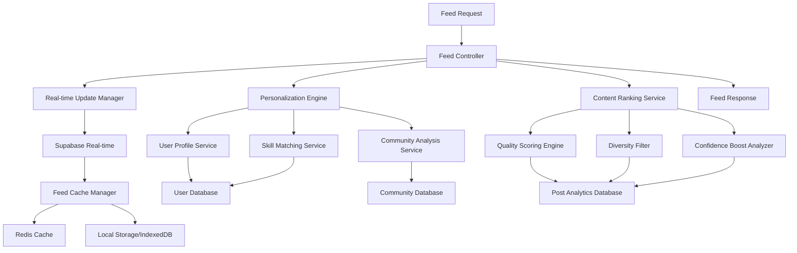
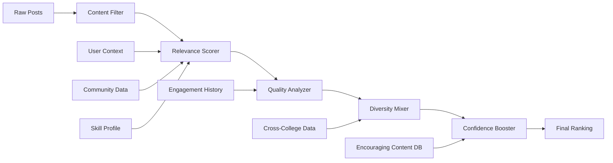

# Feed Algorithm System Design

## Overview

The Feed Algorithm System is designed as a sophisticated, student-centric content discovery engine that prioritizes meaningful engagement, cross-college diversity, and confidence-building experiences. The system combines machine learning-based personalization with real-time content delivery, offline capabilities, and privacy-aware processing to create feeds that genuinely support student growth and authentic connection.

## Architecture

### System Architecture Overview



### Algorithm Architecture



## Components and Interfaces

### Core Components

#### 1. Feed Controller
```typescript
interface FeedController {
  generateFeed(userId: string, options: FeedOptions): Promise<FeedResponse>;
  refreshFeed(userId: string, lastPostId?: string): Promise<FeedResponse>;
  getRealtimeUpdates(userId: string): Observable<FeedUpdate>;
}

interface FeedOptions {
  limit: number;
  offset: number;
  includeAnonymous: boolean;
  communityFilter?: string[];
  contentTypes?: PostType[];
  timeRange?: TimeRange;
}

interface FeedResponse {
  posts: RankedPost[];
  hasMore: boolean;
  nextCursor: string;
  metadata: FeedMetadata;
}
```

#### 2. Personalization Engine
```typescript
interface PersonalizationEngine {
  calculateUserInterests(userId: string): Promise<UserInterests>;
  getSkillMatches(userId: string, posts: Post[]): Promise<SkillMatchScore[]>;
  updateUserProfile(userId: string, interactions: Interaction[]): Promise<void>;
}

interface UserInterests {
  skills: SkillWeight[];
  communities: CommunityWeight[];
  contentTypes: ContentTypeWeight[];
  engagementPatterns: EngagementPattern[];
  confidenceLevel: number;
}

interface SkillWeight {
  skill: string;
  weight: number;
  confidence: number;
  lastUpdated: Date;
}
```

#### 3. Content Ranking Service
```typescript
interface ContentRankingService {
  rankPosts(posts: Post[], userContext: UserContext): Promise<RankedPost[]>;
  calculateRelevanceScore(post: Post, userInterests: UserInterests): number;
  calculateQualityScore(post: Post): Promise<number>;
  applyDiversityFilter(posts: RankedPost[]): RankedPost[];
}

interface RankedPost extends Post {
  relevanceScore: number;
  qualityScore: number;
  diversityBoost: number;
  confidenceBoost: number;
  finalScore: number;
  rankingReasons: RankingReason[];
}

interface RankingReason {
  type: 'skill_match' | 'community_relevance' | 'quality_boost' | 'diversity' | 'confidence_building';
  score: number;
  explanation: string;
}
```

#### 4. Real-time Update Manager
```typescript
interface RealtimeUpdateManager {
  subscribeToUpdates(userId: string): Subscription;
  processNewPost(post: Post): Promise<void>;
  processInteraction(interaction: Interaction): Promise<void>;
  batchUpdates(updates: FeedUpdate[]): Promise<void>;
}

interface FeedUpdate {
  type: 'new_post' | 'post_update' | 'interaction_update' | 'ranking_change';
  postId: string;
  userId: string;
  data: any;
  timestamp: Date;
}
```

### Data Models

#### User Context Model
```typescript
interface UserContext {
  userId: string;
  currentTime: Date;
  deviceType: 'mobile' | 'tablet' | 'desktop';
  connectionQuality: 'high' | 'medium' | 'low';
  sessionContext: 'study' | 'break' | 'commute' | 'evening';
  lastActiveTime: Date;
  privacySettings: PrivacySettings;
}

interface PrivacySettings {
  allowPersonalization: boolean;
  allowCrossCollegeContent: boolean;
  allowSkillBasedMatching: boolean;
  anonymousInteractionTracking: boolean;
}
```

#### Content Quality Metrics
```typescript
interface ContentQualityMetrics {
  engagementDepth: number; // Average comment length and thoughtfulness
  responseQuality: number; // Helpfulness of responses received
  conversationStarter: number; // Likelihood to generate meaningful discussion
  supportiveLanguage: number; // Presence of encouraging, supportive language
  educationalValue: number; // Learning potential and knowledge sharing
  authenticity: number; // Genuine personal sharing vs. performative content
}
```

#### Diversity Metrics
```typescript
interface DiversityMetrics {
  collegeDistribution: Record<string, number>;
  skillAreaDistribution: Record<string, number>;
  contentTypeDistribution: Record<PostType, number>;
  experienceLevelDistribution: Record<string, number>;
  geographicDistribution: Record<string, number>;
}
```

## Algorithm Design

### Personalization Algorithm

#### Skill-Based Matching
```typescript
class SkillMatcher {
  calculateSkillRelevance(userSkills: SkillWeight[], postSkills: string[]): number {
    let totalRelevance = 0;
    let matchCount = 0;
    
    for (const postSkill of postSkills) {
      const userSkill = userSkills.find(s => s.skill === postSkill);
      if (userSkill) {
        // Direct skill match with confidence weighting
        totalRelevance += userSkill.weight * userSkill.confidence;
        matchCount++;
      } else {
        // Check for related skills using skill taxonomy
        const relatedSkills = this.getRelatedSkills(postSkill);
        for (const related of relatedSkills) {
          const userRelated = userSkills.find(s => s.skill === related.skill);
          if (userRelated) {
            totalRelevance += userRelated.weight * related.similarity * 0.7;
            matchCount += 0.7;
          }
        }
      }
    }
    
    return matchCount > 0 ? totalRelevance / matchCount : 0;
  }
  
  private getRelatedSkills(skill: string): RelatedSkill[] {
    // Implementation would use skill taxonomy/ontology
    // e.g., React -> JavaScript, Frontend Development, Web Development
    return this.skillTaxonomy.getRelated(skill);
  }
}
```

#### Community Relevance Scoring
```typescript
class CommunityRelevanceScorer {
  calculateCommunityRelevance(userCommunities: CommunityWeight[], post: Post): number {
    if (post.communityId) {
      const userCommunity = userCommunities.find(c => c.communityId === post.communityId);
      if (userCommunity) {
        return userCommunity.weight * userCommunity.engagementLevel;
      }
    }
    
    // Check for cross-community relevance based on topics
    let crossRelevance = 0;
    for (const userCommunity of userCommunities) {
      const topicOverlap = this.calculateTopicOverlap(userCommunity.topics, post.labels);
      crossRelevance += topicOverlap * userCommunity.weight * 0.5;
    }
    
    return crossRelevance;
  }
  
  private calculateTopicOverlap(communityTopics: string[], postLabels: string[]): number {
    const intersection = communityTopics.filter(topic => 
      postLabels.some(label => this.areTopicsRelated(topic, label))
    );
    return intersection.length / Math.max(communityTopics.length, postLabels.length);
  }
}
```

### Quality Scoring Algorithm

#### Engagement Quality Analysis
```typescript
class EngagementQualityAnalyzer {
  calculateQualityScore(post: Post, interactions: Interaction[]): number {
    const metrics = {
      commentDepth: this.analyzeCommentDepth(interactions),
      responseTime: this.analyzeResponseTime(interactions),
      supportiveLanguage: this.analyzeSupportiveLanguage(interactions),
      followUpActions: this.analyzeFollowUpActions(interactions),
      expertEngagement: this.analyzeExpertEngagement(interactions)
    };
    
    // Weighted combination of quality metrics
    return (
      metrics.commentDepth * 0.3 +
      metrics.responseTime * 0.15 +
      metrics.supportiveLanguage * 0.25 +
      metrics.followUpActions * 0.2 +
      metrics.expertEngagement * 0.1
    );
  }
  
  private analyzeCommentDepth(interactions: Interaction[]): number {
    const comments = interactions.filter(i => i.type === 'comment');
    if (comments.length === 0) return 0;
    
    const avgLength = comments.reduce((sum, c) => sum + c.content.length, 0) / comments.length;
    const threadDepth = Math.max(...comments.map(c => c.threadDepth || 1));
    
    // Normalize and combine length and depth metrics
    return Math.min(1, (avgLength / 200) * 0.7 + (threadDepth / 5) * 0.3);
  }
  
  private analyzeSupportiveLanguage(interactions: Interaction[]): number {
    // Use NLP to detect encouraging, helpful language patterns
    const supportivePatterns = [
      /great (work|job|progress)/i,
      /keep (it up|going)/i,
      /proud of you/i,
      /you('re| are) doing (great|well)/i,
      /happy to help/i,
      /let me know if/i
    ];
    
    let supportiveCount = 0;
    for (const interaction of interactions) {
      if (interaction.type === 'comment') {
        const matches = supportivePatterns.filter(pattern => 
          pattern.test(interaction.content)
        ).length;
        supportiveCount += matches;
      }
    }
    
    return Math.min(1, supportiveCount / interactions.length);
  }
}
```

### Diversity Algorithm

#### Cross-College Content Mixing
```typescript
class DiversityMixer {
  applyDiversityFilter(rankedPosts: RankedPost[], userContext: UserContext): RankedPost[] {
    const diversityTargets = {
      colleges: 3, // Minimum 3 different colleges
      skillAreas: 4, // Minimum 4 different skill areas
      contentTypes: 2, // Mix of post types
      experienceLevels: 3 // Different experience levels
    };
    
    const result: RankedPost[] = [];
    const diversityTracker = new DiversityTracker();
    
    // First pass: Add highest-scoring posts while tracking diversity
    for (const post of rankedPosts) {
      if (this.shouldIncludeForDiversity(post, diversityTracker, diversityTargets)) {
        result.push({
          ...post,
          diversityBoost: this.calculateDiversityBoost(post, diversityTracker)
        });
        diversityTracker.addPost(post);
      }
      
      if (result.length >= 20) break; // Initial batch size
    }
    
    // Second pass: Fill remaining slots with diversity-boosted content
    this.fillDiversityGaps(result, rankedPosts, diversityTracker, diversityTargets);
    
    return result.sort((a, b) => b.finalScore - a.finalScore);
  }
  
  private calculateDiversityBoost(post: RankedPost, tracker: DiversityTracker): number {
    let boost = 0;
    
    // Boost for underrepresented colleges
    if (tracker.getCollegeCount(post.authorCollege) < 2) {
      boost += 0.2;
    }
    
    // Boost for underrepresented skill areas
    const postSkillAreas = this.extractSkillAreas(post.labels);
    for (const skillArea of postSkillAreas) {
      if (tracker.getSkillAreaCount(skillArea) < 2) {
        boost += 0.1;
      }
    }
    
    return Math.min(0.5, boost); // Cap diversity boost
  }
}
```

### Confidence-Building Algorithm

#### Encouraging Content Prioritization
```typescript
class ConfidenceBoostAnalyzer {
  calculateConfidenceBoost(post: Post, userContext: UserContext): number {
    const confidenceFactors = {
      firstTimeSharing: this.isFirstTimeSharing(post),
      learningProgress: this.detectsLearningProgress(post),
      vulnerableSharing: this.detectsVulnerableSharing(post),
      supportiveResponse: this.hasSupportiveResponses(post),
      mentorshipOffer: this.containsMentorshipOffer(post),
      celebratesSmallWins: this.celebratesSmallWins(post)
    };
    
    let boost = 0;
    
    // Boost content that builds confidence
    if (confidenceFactors.firstTimeSharing) boost += 0.3;
    if (confidenceFactors.learningProgress) boost += 0.2;
    if (confidenceFactors.vulnerableSharing) boost += 0.25;
    if (confidenceFactors.supportiveResponse) boost += 0.15;
    if (confidenceFactors.mentorshipOffer) boost += 0.2;
    if (confidenceFactors.celebratesSmallWins) boost += 0.1;
    
    // Additional boost for users with low confidence scores
    if (userContext.confidenceLevel < 0.5) {
      boost *= 1.5;
    }
    
    return Math.min(0.6, boost); // Cap confidence boost
  }
  
  private detectsLearningProgress(post: Post): boolean {
    const progressPatterns = [
      /first time/i,
      /just learned/i,
      /finally (understand|got it)/i,
      /making progress/i,
      /small step/i,
      /getting better at/i
    ];
    
    return progressPatterns.some(pattern => 
      pattern.test(post.content) || 
      post.labels.some(label => pattern.test(label))
    );
  }
  
  private celebratesSmallWins(post: Post): boolean {
    const celebrationPatterns = [
      /small win/i,
      /tiny victory/i,
      /baby steps/i,
      /proud of myself/i,
      /feels good/i,
      /accomplished/i
    ];
    
    return post.type === 'win' && celebrationPatterns.some(pattern => 
      pattern.test(post.content)
    );
  }
}
```

## Real-time Features Implementation

### Supabase Real-time Integration
```typescript
class RealtimeFeedManager {
  private subscriptions = new Map<string, RealtimeChannel>();
  
  subscribeToFeedUpdates(userId: string): Observable<FeedUpdate> {
    const channel = supabase
      .channel(`feed-${userId}`)
      .on('postgres_changes', {
        event: '*',
        schema: 'public',
        table: 'posts',
        filter: this.buildPostFilter(userId)
      }, this.handlePostChange.bind(this))
      .on('postgres_changes', {
        event: '*',
        schema: 'public',
        table: 'post_interactions',
        filter: this.buildInteractionFilter(userId)
      }, this.handleInteractionChange.bind(this))
      .subscribe();
    
    this.subscriptions.set(userId, channel);
    
    return new Observable(subscriber => {
      this.feedUpdateSubject.subscribe(subscriber);
      
      return () => {
        channel.unsubscribe();
        this.subscriptions.delete(userId);
      };
    });
  }
  
  private async handlePostChange(payload: any) {
    const post = payload.new as Post;
    
    // Re-rank affected feeds
    const affectedUsers = await this.getAffectedUsers(post);
    
    for (const userId of affectedUsers) {
      const updatedRanking = await this.recalculateRanking(userId, post);
      
      this.feedUpdateSubject.next({
        type: 'new_post',
        userId,
        postId: post.id,
        data: updatedRanking,
        timestamp: new Date()
      });
    }
  }
  
  private async getAffectedUsers(post: Post): Promise<string[]> {
    // Find users who should see this post based on:
    // - Community membership
    // - Skill matches
    // - College connections
    // - Following relationships
    
    const queries = [
      // Community members
      supabase
        .from('community_members')
        .select('user_id')
        .eq('community_id', post.communityId),
      
      // Users with matching skills
      this.getUsersWithMatchingSkills(post.labels),
      
      // Users from same college
      supabase
        .from('profiles')
        .select('id')
        .eq('college_id', post.authorCollegeId)
    ];
    
    const results = await Promise.all(queries);
    const userIds = new Set<string>();
    
    results.forEach(result => {
      result.data?.forEach(row => userIds.add(row.user_id || row.id));
    });
    
    return Array.from(userIds);
  }
}
```

### Offline Caching Strategy
```typescript
class OfflineCacheManager {
  private cache = new Map<string, CachedFeed>();
  private storage: IDBDatabase;
  
  async cacheFeed(userId: string, posts: RankedPost[]): Promise<void> {
    const cacheEntry: CachedFeed = {
      userId,
      posts: posts.slice(0, 100), // Cache top 100 posts
      timestamp: new Date(),
      expiresAt: new Date(Date.now() + 24 * 60 * 60 * 1000) // 24 hours
    };
    
    // Memory cache for immediate access
    this.cache.set(userId, cacheEntry);
    
    // IndexedDB for persistent storage
    await this.storeInIndexedDB(cacheEntry);
  }
  
  async getCachedFeed(userId: string): Promise<RankedPost[] | null> {
    // Check memory cache first
    const memoryCache = this.cache.get(userId);
    if (memoryCache && memoryCache.expiresAt > new Date()) {
      return memoryCache.posts;
    }
    
    // Check IndexedDB
    const persistentCache = await this.getFromIndexedDB(userId);
    if (persistentCache && persistentCache.expiresAt > new Date()) {
      // Restore to memory cache
      this.cache.set(userId, persistentCache);
      return persistentCache.posts;
    }
    
    return null;
  }
  
  async queueOfflineInteraction(interaction: OfflineInteraction): Promise<void> {
    const queue = await this.getOfflineQueue();
    queue.push({
      ...interaction,
      id: generateId(),
      timestamp: new Date(),
      retryCount: 0
    });
    
    await this.storeOfflineQueue(queue);
  }
  
  async syncOfflineInteractions(): Promise<void> {
    const queue = await this.getOfflineQueue();
    const successful: string[] = [];
    
    for (const interaction of queue) {
      try {
        await this.processOfflineInteraction(interaction);
        successful.push(interaction.id);
      } catch (error) {
        interaction.retryCount++;
        if (interaction.retryCount > 3) {
          // Remove failed interactions after 3 retries
          successful.push(interaction.id);
        }
      }
    }
    
    // Remove processed interactions
    const remainingQueue = queue.filter(i => !successful.includes(i.id));
    await this.storeOfflineQueue(remainingQueue);
  }
}
```

## Performance Optimization

### Caching Strategy
```typescript
class FeedCacheStrategy {
  private redisClient: Redis;
  private localCache = new LRUCache<string, any>({ max: 1000 });
  
  async getCachedFeed(userId: string, options: FeedOptions): Promise<FeedResponse | null> {
    const cacheKey = this.generateCacheKey(userId, options);
    
    // L1: Memory cache (fastest)
    const memoryResult = this.localCache.get(cacheKey);
    if (memoryResult) return memoryResult;
    
    // L2: Redis cache (fast)
    const redisResult = await this.redisClient.get(cacheKey);
    if (redisResult) {
      const parsed = JSON.parse(redisResult);
      this.localCache.set(cacheKey, parsed);
      return parsed;
    }
    
    return null;
  }
  
  async cacheFeed(userId: string, options: FeedOptions, feed: FeedResponse): Promise<void> {
    const cacheKey = this.generateCacheKey(userId, options);
    
    // Cache in memory
    this.localCache.set(cacheKey, feed);
    
    // Cache in Redis with TTL
    await this.redisClient.setex(cacheKey, 300, JSON.stringify(feed)); // 5 minutes
  }
  
  async invalidateUserCache(userId: string): Promise<void> {
    const pattern = `feed:${userId}:*`;
    
    // Clear memory cache
    for (const key of this.localCache.keys()) {
      if (key.startsWith(`feed:${userId}:`)) {
        this.localCache.delete(key);
      }
    }
    
    // Clear Redis cache
    const keys = await this.redisClient.keys(pattern);
    if (keys.length > 0) {
      await this.redisClient.del(...keys);
    }
  }
}
```

### Algorithm Performance Optimization
```typescript
class PerformanceOptimizedRanker {
  private skillCache = new Map<string, SkillWeight[]>();
  private communityCache = new Map<string, CommunityWeight[]>();
  
  async rankPostsBatch(posts: Post[], userContext: UserContext): Promise<RankedPost[]> {
    // Batch process posts for better performance
    const batchSize = 50;
    const batches = this.chunkArray(posts, batchSize);
    const results: RankedPost[] = [];
    
    // Pre-load user data once
    const userInterests = await this.getCachedUserInterests(userContext.userId);
    
    // Process batches in parallel
    const batchPromises = batches.map(batch => 
      this.rankPostsBatchInternal(batch, userContext, userInterests)
    );
    
    const batchResults = await Promise.all(batchPromises);
    
    // Combine and sort results
    for (const batchResult of batchResults) {
      results.push(...batchResult);
    }
    
    return results.sort((a, b) => b.finalScore - a.finalScore);
  }
  
  private async getCachedUserInterests(userId: string): Promise<UserInterests> {
    const cacheKey = `user_interests:${userId}`;
    
    let interests = this.localCache.get(cacheKey);
    if (!interests) {
      interests = await this.personalizationEngine.calculateUserInterests(userId);
      this.localCache.set(cacheKey, interests, { ttl: 3600 }); // 1 hour
    }
    
    return interests;
  }
  
  private async rankPostsBatchInternal(
    posts: Post[], 
    userContext: UserContext, 
    userInterests: UserInterests
  ): Promise<RankedPost[]> {
    const rankedPosts: RankedPost[] = [];
    
    for (const post of posts) {
      const relevanceScore = this.calculateRelevanceScore(post, userInterests);
      const qualityScore = await this.getCachedQualityScore(post);
      const diversityBoost = 0; // Will be calculated later in diversity filter
      const confidenceBoost = this.calculateConfidenceBoost(post, userContext);
      
      const finalScore = (
        relevanceScore * 0.4 +
        qualityScore * 0.3 +
        confidenceBoost * 0.2 +
        diversityBoost * 0.1
      );
      
      rankedPosts.push({
        ...post,
        relevanceScore,
        qualityScore,
        diversityBoost,
        confidenceBoost,
        finalScore,
        rankingReasons: this.generateRankingReasons(relevanceScore, qualityScore, confidenceBoost)
      });
    }
    
    return rankedPosts;
  }
}
```

## Testing Strategy

### Algorithm Testing
```typescript
describe('Feed Algorithm', () => {
  describe('Personalization', () => {
    it('should prioritize content from user communities', async () => {
      const user = createTestUser({ communities: ['ai-ml', 'web-dev'] });
      const posts = [
        createTestPost({ communityId: 'ai-ml', content: 'ML project update' }),
        createTestPost({ communityId: 'design', content: 'UI design tips' }),
        createTestPost({ communityId: 'web-dev', content: 'React tutorial' })
      ];
      
      const rankedPosts = await feedAlgorithm.rankPosts(posts, user);
      
      expect(rankedPosts[0].communityId).toBeOneOf(['ai-ml', 'web-dev']);
      expect(rankedPosts[0].relevanceScore).toBeGreaterThan(0.7);
    });
    
    it('should match content based on user skills', async () => {
      const user = createTestUser({ skills: [{ skill: 'React', weight: 0.9 }] });
      const posts = [
        createTestPost({ labels: ['React', 'Frontend'] }),
        createTestPost({ labels: ['Python', 'Backend'] })
      ];
      
      const rankedPosts = await feedAlgorithm.rankPosts(posts, user);
      
      expect(rankedPosts[0].labels).toContain('React');
    });
  });
  
  describe('Quality Scoring', () => {
    it('should prioritize posts with thoughtful comments', async () => {
      const postWithQualityComments = createTestPost({
        interactions: [
          createTestComment({ content: 'Great work! I love how you approached the state management. Have you considered using Redux Toolkit for this? It might simplify your code even further.' }),
          createTestComment({ content: 'This is really helpful. I was struggling with the same issue last week.' })
        ]
      });
      
      const postWithSimpleReactions = createTestPost({
        interactions: [
          createTestKudos(),
          createTestKudos(),
          createTestComment({ content: 'Nice!' })
        ]
      });
      
      const qualityScore1 = await qualityAnalyzer.calculateQualityScore(postWithQualityComments);
      const qualityScore2 = await qualityAnalyzer.calculateQualityScore(postWithSimpleReactions);
      
      expect(qualityScore1).toBeGreaterThan(qualityScore2);
    });
  });
  
  describe('Diversity', () => {
    it('should include content from multiple colleges', async () => {
      const posts = createTestPosts([
        { authorCollege: 'MIT' },
        { authorCollege: 'Stanford' },
        { authorCollege: 'Berkeley' },
        { authorCollege: 'MIT' },
        { authorCollege: 'MIT' }
      ]);
      
      const diversePosts = diversityMixer.applyDiversityFilter(posts, userContext);
      const colleges = new Set(diversePosts.map(p => p.authorCollege));
      
      expect(colleges.size).toBeGreaterThanOrEqual(3);
    });
  });
});
```

This comprehensive design document provides the foundation for implementing a sophisticated feed algorithm that prioritizes student well-being, authentic engagement, and meaningful content discovery while maintaining high performance and scalability.