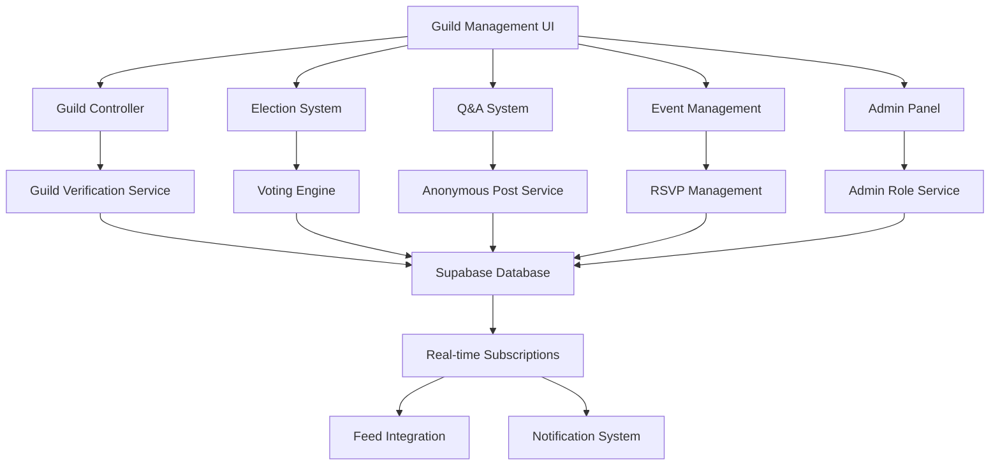

# Guild System Design

## Overview

The Guild System is designed as the official college representation hub within Ascend, providing verified, trusted spaces for college-specific activities, aspirant support, and institutional continuity. The system combines democratic governance tools, anonymous Q&A capabilities, event management, and knowledge preservation to create authentic college communities that transcend individual student tenures.

## Architecture

### System Architecture Overview



### Component Architecture

```mermaid
graph LR
    A[GuildHub] --> B[GuildHeader]
    A --> C[NavigationTabs]
    A --> D[ContentArea]
    
    C --> E[OverviewTab]
    C --> F[QATab]
    C --> G[EventsTab]
    C --> H[ElectionsTab]
    C --> I[AdminTab]
    
    D --> J[PostFeed]
    D --> K[AnonymousQA]
    D --> L[EventList]
    D --> M[ElectionInterface]
    D --> N[AdminControls]
```#
## Database Schema Integration (from database-schema-spec)

```sql
-- Core guild tables referenced from database-schema-spec
-- guilds: Main guild information with college_name, verification_status, admin_users
-- guild_members: User-guild relationships with join_date, role, status
-- guild_posts: Guild-specific posts with type, anonymous flag, category
-- guild_qa: Q&A system with questions, answers, anonymous support
-- guild_events: Event management with RSVP tracking, capacity limits
-- guild_elections: Digital voting system with candidates, votes, results
-- guild_admin_logs: Audit trail for all admin actions and changes
-- guild_knowledge_base: Institutional memory and archived content
```

### API Endpoint Integration (from api-endpoints-spec)

```typescript
// Guild API endpoints
const GUILD_API_ENDPOINTS = {
  // Guild management
  createGuild: 'POST /api/v1/guilds',
  getGuild: 'GET /api/v1/guilds/:guildId',
  updateGuild: 'PATCH /api/v1/guilds/:guildId',
  verifyGuild: 'POST /api/v1/guilds/:guildId/verify',
  
  // Membership management
  joinGuild: 'POST /api/v1/guilds/:guildId/join',
  leaveGuild: 'DELETE /api/v1/guilds/:guildId/leave',
  getMembers: 'GET /api/v1/guilds/:guildId/members',
  
  // Admin management
  addAdmin: 'POST /api/v1/guilds/:guildId/admins',
  removeAdmin: 'DELETE /api/v1/guilds/:guildId/admins/:userId',
  updateAdminRole: 'PATCH /api/v1/guilds/:guildId/admins/:userId',
  
  // Q&A system
  createQuestion: 'POST /api/v1/guilds/:guildId/qa/questions',
  answerQuestion: 'POST /api/v1/guilds/:guildId/qa/questions/:questionId/answers',
  getQA: 'GET /api/v1/guilds/:guildId/qa',
  
  // Events
  createEvent: 'POST /api/v1/guilds/:guildId/events',
  rsvpEvent: 'POST /api/v1/guilds/:guildId/events/:eventId/rsvp',
  getEvents: 'GET /api/v1/guilds/:guildId/events',
  
  // Elections
  createElection: 'POST /api/v1/guilds/:guildId/elections',
  vote: 'POST /api/v1/guilds/:guildId/elections/:electionId/vote',
  getElectionResults: 'GET /api/v1/guilds/:guildId/elections/:electionId/results'
};
```## Co
mponents and Interfaces

### Core Components

#### 1. Guild Management Service
```typescript
interface GuildManagementService {
  createGuild(guildData: CreateGuildData): Promise<Guild>;
  verifyGuild(guildId: string, verificationData: VerificationData): Promise<void>;
  updateGuildInfo(guildId: string, updates: GuildUpdates): Promise<Guild>;
  getGuildMembers(guildId: string, filters?: MemberFilters): Promise<GuildMember[]>;
}

interface CreateGuildData {
  collegeName: string;
  collegeDomain: string;
  adminEmail: string;
  verificationDocuments: VerificationDocument[];
  description: string;
  logoUrl?: string;
}

interface Guild {
  id: string;
  collegeName: string;
  collegeDomain: string;
  isVerified: boolean;
  adminUsers: string[];
  memberCount: number;
  description: string;
  logoUrl?: string;
  createdAt: Date;
  verifiedAt?: Date;
}
```

#### 2. Guild Admin Service
```typescript
interface GuildAdminService {
  addAdmin(guildId: string, userId: string, role: AdminRole): Promise<void>;
  removeAdmin(guildId: string, userId: string): Promise<void>;
  updateAdminRole(guildId: string, userId: string, newRole: AdminRole): Promise<void>;
  getAdminLogs(guildId: string, filters?: LogFilters): Promise<AdminLog[]>;
}

enum AdminRole {
  SUPER_ADMIN = 'super_admin',
  CONTENT_ADMIN = 'content_admin',
  EVENT_ADMIN = 'event_admin',
  ELECTION_ADMIN = 'election_admin'
}

interface AdminLog {
  id: string;
  guildId: string;
  adminId: string;
  action: AdminAction;
  targetId?: string;
  details: any;
  timestamp: Date;
}
```####
 3. Anonymous Q&A Service
```typescript
interface AnonymousQAService {
  createQuestion(guildId: string, questionData: CreateQuestionData): Promise<Question>;
  answerQuestion(questionId: string, answerData: CreateAnswerData): Promise<Answer>;
  getQuestions(guildId: string, filters?: QAFilters): Promise<Question[]>;
  moderateContent(contentId: string, action: ModerationAction): Promise<void>;
}

interface CreateQuestionData {
  content: string;
  category: QuestionCategory;
  isAnonymous: boolean;
  tags: string[];
}

interface Question {
  id: string;
  guildId: string;
  content: string;
  category: QuestionCategory;
  isAnonymous: boolean;
  tags: string[];
  answers: Answer[];
  upvotes: number;
  createdAt: Date;
  authorId?: string; // null if anonymous
}

enum QuestionCategory {
  ACADEMICS = 'academics',
  CAMPUS_LIFE = 'campus_life',
  ADMISSIONS = 'admissions',
  PLACEMENTS = 'placements',
  CULTURE = 'culture',
  FACILITIES = 'facilities'
}
```

#### 4. Digital Election Service
```typescript
interface DigitalElectionService {
  createElection(guildId: string, electionData: CreateElectionData): Promise<Election>;
  addCandidate(electionId: string, candidateData: CandidateData): Promise<void>;
  castVote(electionId: string, vote: VoteData): Promise<VoteReceipt>;
  getResults(electionId: string): Promise<ElectionResults>;
  closeElection(electionId: string): Promise<FinalResults>;
}

interface CreateElectionData {
  title: string;
  description: string;
  type: ElectionType;
  startDate: Date;
  endDate: Date;
  eligibleVoters: string[];
  positions: ElectionPosition[];
}

enum ElectionType {
  STUDENT_COUNCIL = 'student_council',
  REPRESENTATIVE = 'representative',
  REFERENDUM = 'referendum'
}

interface Election {
  id: string;
  guildId: string;
  title: string;
  description: string;
  type: ElectionType;
  status: ElectionStatus;
  startDate: Date;
  endDate: Date;
  candidates: Candidate[];
  totalVotes: number;
  eligibleVoters: number;
}
```#### 
5. Event Management Service
```typescript
interface EventManagementService {
  createEvent(guildId: string, eventData: CreateEventData): Promise<GuildEvent>;
  updateEvent(eventId: string, updates: EventUpdates): Promise<GuildEvent>;
  rsvpEvent(eventId: string, userId: string, response: RSVPResponse): Promise<void>;
  getEventAttendees(eventId: string): Promise<EventAttendee[]>;
  sendEventReminders(eventId: string): Promise<void>;
}

interface CreateEventData {
  title: string;
  description: string;
  type: EventType;
  startDate: Date;
  endDate: Date;
  location: string;
  capacity?: number;
  requiresRSVP: boolean;
  isPublic: boolean;
}

enum EventType {
  WORKSHOP = 'workshop',
  SEMINAR = 'seminar',
  SOCIAL = 'social',
  ACADEMIC = 'academic',
  CULTURAL = 'cultural',
  SPORTS = 'sports'
}

interface GuildEvent {
  id: string;
  guildId: string;
  title: string;
  description: string;
  type: EventType;
  startDate: Date;
  endDate: Date;
  location: string;
  capacity?: number;
  attendeeCount: number;
  waitlistCount: number;
  createdBy: string;
  createdAt: Date;
}
```

#### 6. Knowledge Base Service
```typescript
interface KnowledgeBaseService {
  archiveContent(guildId: string, contentId: string, category: ArchiveCategory): Promise<void>;
  searchArchive(guildId: string, query: string, filters?: ArchiveFilters): Promise<ArchivedContent[]>;
  createKnowledgeEntry(guildId: string, entryData: KnowledgeEntryData): Promise<KnowledgeEntry>;
  transferKnowledge(guildId: string, fromAdminId: string, toAdminId: string): Promise<void>;
}

interface KnowledgeEntry {
  id: string;
  guildId: string;
  title: string;
  content: string;
  category: ArchiveCategory;
  tags: string[];
  createdBy: string;
  createdAt: Date;
  lastUpdated: Date;
  importance: ImportanceLevel;
}

enum ArchiveCategory {
  DECISIONS = 'decisions',
  EVENTS = 'events',
  POLICIES = 'policies',
  PROCEDURES = 'procedures',
  CONTACTS = 'contacts',
  RESOURCES = 'resources'
}
```#
# Data Models

### Guild Data Model
```typescript
interface Guild {
  id: string;
  collegeName: string;
  collegeDomain: string;
  isVerified: boolean;
  verificationStatus: VerificationStatus;
  adminUsers: AdminUser[];
  memberCount: number;
  description: string;
  logoUrl?: string;
  bannerUrl?: string;
  socialLinks: SocialLink[];
  settings: GuildSettings;
  createdAt: Date;
  verifiedAt?: Date;
  lastActivity: Date;
}

interface AdminUser {
  userId: string;
  role: AdminRole;
  permissions: Permission[];
  assignedAt: Date;
  assignedBy: string;
}

interface GuildSettings {
  allowAnonymousQA: boolean;
  requireApprovalForEvents: boolean;
  enableElections: boolean;
  publicVisibility: boolean;
  allowCrossPosting: boolean;
}
```

### Election Data Model
```typescript
interface Election {
  id: string;
  guildId: string;
  title: string;
  description: string;
  type: ElectionType;
  status: ElectionStatus;
  startDate: Date;
  endDate: Date;
  positions: ElectionPosition[];
  candidates: Candidate[];
  votes: EncryptedVote[];
  results?: ElectionResults;
  auditTrail: AuditEntry[];
}

interface Candidate {
  id: string;
  userId: string;
  positionId: string;
  manifesto: string;
  endorsements: Endorsement[];
  voteCount?: number;
}

interface EncryptedVote {
  id: string;
  electionId: string;
  voterHash: string; // Anonymized voter identifier
  encryptedBallot: string;
  timestamp: Date;
  verified: boolean;
}
```
### Campus Confidence Integration

```typescript
// Campus Confidence design integration for guild system
const GUILD_UI_COLORS = {
  officialVerification: 'var(--ascend-blue)', // #2563EB - Official guild verification
  adminActions: 'var(--confidence-teal)', // #0891B2 - Admin controls and management
  elections: 'var(--gentle-purple)', // #7C3AED - Democratic participation
  events: 'var(--warm-coral)', // #F97316 - Community events and gatherings
  anonymousQA: 'var(--safety-blue)', // #3B82F6 - Anonymous posting protection
  achievements: 'var(--success-green)' // #059669 - Guild milestones and celebrations
};

// Campus Confidence celebration animations for guild activities
const GUILD_CELEBRATIONS = {
  guildVerified: {
    animation: 'officialBadgeGlow',
    duration: 3000,
    colors: ['var(--ascend-blue)', 'var(--success-green)'],
    message: 'Your college guild is now officially verified! 🏛️✨',
    hapticPattern: [100, 200, 100, 200, 100]
  },
  
  firstVote: {
    animation: 'democraticSparkle',
    duration: 2500,
    colors: ['var(--gentle-purple)', 'var(--confidence-teal)'],
    message: 'You participated in democracy! Your voice matters! 🗳️',
    hapticPattern: [80, 160, 80]
  },
  
  eventRSVP: {
    animation: 'communityConnect',
    duration: 2000,
    colors: ['var(--warm-coral)', 'var(--ascend-blue)'],
    message: 'See you at the event! Building community together! 🎉',
    hapticPattern: [60, 120, 60]
  },
  
  helpfulAnswer: {
    animation: 'knowledgeShare',
    duration: 2000,
    colors: ['var(--success-green)', 'var(--confidence-teal)'],
    message: 'Thank you for helping an aspirant! Knowledge shared! 📚',
    hapticPattern: [40, 80, 40]
  },
  
  adminPromotion: {
    animation: 'leadershipBadge',
    duration: 3500,
    colors: ['var(--ascend-blue)', 'var(--gentle-purple)', 'var(--warm-coral)'],
    message: 'Welcome to guild leadership! Ready to serve your college! 👑',
    hapticPattern: [120, 240, 120, 240, 120]
  }
};

// Campus Confidence micro-interactions for guild UI
const GUILD_MICRO_INTERACTIONS = {
  verificationBadge: {
    hover: 'badgePulse 0.6s ease-in-out',
    click: 'verificationGlow 0.8s ease-out'
  },
  
  voteButton: {
    hover: 'scale(1.05) + democraticGlow',
    active: 'scale(0.95) + voteConfirm',
    success: 'ballotSubmit 1.0s ease-out'
  },
  
  rsvpButton: {
    hover: 'eventHighlight 0.4s ease-in-out',
    success: 'attendeeAdd 0.6s ease-out'
  },
  
  anonymousToggle: {
    toggle: 'privacyShield 0.5s ease-in-out',
    enabled: 'anonymousProtect 0.8s ease-out'
  }
};
```## Rea
l-time Features Implementation

### Supabase Real-time Integration
```typescript
class GuildRealtimeManager {
  private subscriptions = new Map<string, RealtimeChannel>();
  
  subscribeToGuildUpdates(guildId: string): Observable<GuildUpdate> {
    const channel = supabase
      .channel(`guild-${guildId}`)
      .on('postgres_changes', {
        event: '*',
        schema: 'public',
        table: 'guild_posts',
        filter: `guild_id=eq.${guildId}`
      }, this.handleGuildPostChange.bind(this))
      .on('postgres_changes', {
        event: '*',
        schema: 'public',
        table: 'guild_events',
        filter: `guild_id=eq.${guildId}`
      }, this.handleEventChange.bind(this))
      .on('postgres_changes', {
        event: '*',
        schema: 'public',
        table: 'guild_elections',
        filter: `guild_id=eq.${guildId}`
      }, this.handleElectionChange.bind(this))
      .subscribe();
    
    this.subscriptions.set(guildId, channel);
    
    return new Observable(subscriber => {
      this.guildUpdateSubject.subscribe(subscriber);
      
      return () => {
        channel.unsubscribe();
        this.subscriptions.delete(guildId);
      };
    });
  }
  
  subscribeToElectionResults(electionId: string): Observable<ElectionUpdate> {
    const channel = supabase
      .channel(`election-${electionId}`)
      .on('postgres_changes', {
        event: 'UPDATE',
        schema: 'public',
        table: 'guild_elections',
        filter: `id=eq.${electionId}`
      }, this.handleElectionResultUpdate.bind(this))
      .subscribe();
    
    return new Observable(subscriber => {
      this.electionUpdateSubject.subscribe(subscriber);
      
      return () => channel.unsubscribe();
    });
  }
  
  private async handleElectionResultUpdate(payload: any) {
    const election = payload.new as Election;
    
    // Broadcast real-time election results
    this.electionUpdateSubject.next({
      type: 'results_update',
      electionId: election.id,
      data: election.results,
      timestamp: new Date()
    });
    
    // Trigger celebration if election completed
    if (election.status === 'completed') {
      await this.triggerElectionCompletionCelebration(election);
    }
  }
}
```

## Performance Optimization

### Guild Data Caching Strategy
```typescript
class GuildCacheManager {
  private redis: Redis;
  private localCache = new LRUCache<string, any>({ max: 1000 });
  
  async getCachedGuild(guildId: string): Promise<Guild | null> {
    // L1: Memory cache
    const memoryResult = this.localCache.get(`guild:${guildId}`);
    if (memoryResult) return memoryResult;
    
    // L2: Redis cache
    const redisResult = await this.redis.get(`guild:${guildId}`);
    if (redisResult) {
      const parsed = JSON.parse(redisResult);
      this.localCache.set(`guild:${guildId}`, parsed);
      return parsed;
    }
    
    return null;
  }
  
  async cacheGuild(guild: Guild): Promise<void> {
    const cacheKey = `guild:${guild.id}`;
    
    // Cache in memory
    this.localCache.set(cacheKey, guild);
    
    // Cache in Redis with TTL
    await this.redis.setex(cacheKey, 1800, JSON.stringify(guild)); // 30 minutes
  }
  
  async invalidateGuildCache(guildId: string): Promise<void> {
    const cacheKey = `guild:${guildId}`;
    
    // Clear from memory
    this.localCache.delete(cacheKey);
    
    // Clear from Redis
    await this.redis.del(cacheKey);
  }
}
```## Secur
ity Implementation

### Election Security
```typescript
class ElectionSecurityManager {
  private cryptoService: CryptoService;
  
  async castSecureVote(electionId: string, vote: VoteData, voterId: string): Promise<VoteReceipt> {
    // Generate anonymous voter hash
    const voterHash = await this.generateAnonymousHash(voterId, electionId);
    
    // Encrypt the ballot
    const encryptedBallot = await this.cryptoService.encrypt(
      JSON.stringify(vote),
      await this.getElectionPublicKey(electionId)
    );
    
    // Create vote record
    const voteRecord: EncryptedVote = {
      id: generateId(),
      electionId,
      voterHash,
      encryptedBallot,
      timestamp: new Date(),
      verified: false
    };
    
    // Store vote with verification
    await this.storeVoteSecurely(voteRecord);
    
    // Generate receipt without revealing vote content
    return {
      voteId: voteRecord.id,
      electionId,
      timestamp: voteRecord.timestamp,
      verified: true
    };
  }
  
  private async generateAnonymousHash(voterId: string, electionId: string): Promise<string> {
    // Create one-way hash that can't be traced back to voter
    const salt = await this.getElectionSalt(electionId);
    return await this.cryptoService.hash(`${voterId}:${electionId}:${salt}`);
  }
}
```

### Anonymous Q&A Security
```typescript
class AnonymousQASecurityManager {
  async createAnonymousQuestion(questionData: CreateQuestionData): Promise<Question> {
    if (questionData.isAnonymous) {
      // Remove all identifying information
      const sanitizedData = {
        content: questionData.content,
        category: questionData.category,
        tags: questionData.tags,
        isAnonymous: true,
        // No authorId stored for anonymous questions
        guildId: questionData.guildId
      };
      
      // Store without any linkable data
      return await this.questionService.createQuestion(sanitizedData);
    }
    
    return await this.questionService.createQuestion(questionData);
  }
  
  async moderateAnonymousContent(contentId: string, action: ModerationAction): Promise<void> {
    // Moderate content while preserving anonymity
    await this.moderationService.moderateContent(contentId, action, {
      preserveAnonymity: true,
      logAction: true,
      notifyUser: false // Can't notify anonymous users
    });
  }
}
```

## Testing Strategy

### Guild System Testing
```typescript
describe('Guild System', () => {
  describe('Guild Creation and Verification', () => {
    it('should create guild with proper verification requirements', async () => {
      const guildData = {
        collegeName: 'Test University',
        collegeDomain: 'test.edu',
        adminEmail: 'admin@test.edu',
        verificationDocuments: [mockDocument]
      };
      
      const guild = await guildService.createGuild(guildData);
      
      expect(guild.isVerified).toBe(false);
      expect(guild.verificationStatus).toBe('pending');
    });
    
    it('should verify guild with valid documents', async () => {
      const guild = await createTestGuild();
      
      await guildService.verifyGuild(guild.id, {
        documents: validDocuments,
        verifiedBy: 'platform-admin'
      });
      
      const verifiedGuild = await guildService.getGuild(guild.id);
      expect(verifiedGuild.isVerified).toBe(true);
    });
  });
  
  describe('Election System', () => {
    it('should conduct secure anonymous voting', async () => {
      const election = await createTestElection();
      const voter = createTestUser();
      
      const voteReceipt = await electionService.castVote(election.id, {
        candidateId: 'candidate-1'
      }, voter.id);
      
      expect(voteReceipt.verified).toBe(true);
      expect(voteReceipt.voteId).toBeDefined();
      
      // Verify vote anonymity
      const storedVote = await getStoredVote(voteReceipt.voteId);
      expect(storedVote.voterHash).not.toContain(voter.id);
    });
  });
  
  describe('Anonymous Q&A', () => {
    it('should protect user identity in anonymous questions', async () => {
      const questionData = {
        content: 'How is the campus life?',
        category: 'campus_life',
        isAnonymous: true,
        guildId: 'test-guild'
      };
      
      const question = await qaService.createQuestion(questionData);
      
      expect(question.authorId).toBeNull();
      expect(question.isAnonymous).toBe(true);
    });
  });
});
```

This comprehensive design document provides the foundation for implementing a sophisticated guild system that serves college communities while maintaining the highest standards of security, privacy, and user experience that Ascend students deserve.