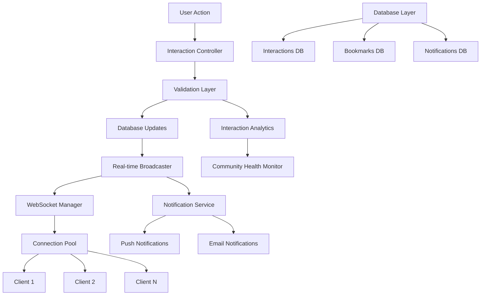
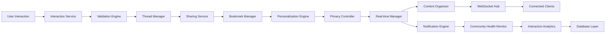

# Interaction System Design

## Overview

The Interaction System is designed as a comprehensive engagement platform that transforms simple social interactions into meaningful connections and learning opportunities. The system combines real-time WebSocket communication, intelligent content analysis, and Campus Confidence design principles that genuinely support student growth, build authentic relationships, and foster academic community.

## Architecture

### System Architecture Overview



### Real-time Communication Architecture



## Components and Interfaces

### Core Components

#### 1. Interaction Controller
```typescript
interface InteractionController {
  createKudos(kudosData: CreateKudosData): Promise<KudosResponse>;
  createComment(commentData: CreateCommentData): Promise<CommentResponse>;
  sharePost(shareData: SharePostData): Promise<ShareResponse>;
  bookmarkPost(bookmarkData: BookmarkData): Promise<BookmarkResponse>;
  getInteractions(postId: string, options: InteractionOptions): Promise<InteractionResponse>;
}

interface InteractionOptions {
  includeThreads: boolean;
  sortBy: 'newest' | 'oldest' | 'most_helpful';
  limit: number;
  offset: number;
}

interface InteractionResponse {
  kudos: Kudos[];
  comments: Comment[];
  shares: Share[];
  bookmarks: Bookmark[];
  totalCount: number;
  hasMore: boolean;
}
```

#### 2. Kudos Manager
```typescript
interface KudosManager {
  createKudos(kudos: CreateKudosData): Promise<Kudos>;
  getKudosForPost(postId: string): Promise<Kudos[]>;
  getKudosAnalytics(userId: string): Promise<KudosAnalytics>;
}

interface Kudos {
  id: string;
  postId: string;
  giverId: string;
  receiverId: string;
  type: KudosType;
  message?: string;
  isAnonymous: boolean;
  createdAt: Date;
  celebrationTriggered: boolean;
}

enum KudosType {
  HELPFUL = 'helpful',
  INSPIRING = 'inspiring',
  WELL_EXPLAINED = 'well_explained',
  CREATIVE = 'creative',
  SUPPORTIVE = 'supportive',
  CUSTOM = 'custom'
}

interface KudosAnalytics {
  totalGiven: number;
  totalReceived: number;
  typeDistribution: Record<KudosType, number>;
  impactScore: number;
  streakCount: number;
}
```

#### 3. Comment Threading Service
```typescript
interface CommentThreadingService {
  createComment(comment: CreateCommentData): Promise<Comment>;
  getCommentThread(postId: string): Promise<CommentThread>;
  replyToComment(parentId: string, reply: CreateCommentData): Promise<Comment>;
  updateComment(commentId: string, updates: UpdateCommentData): Promise<Comment>;
}

interface Comment {
  id: string;
  postId: string;
  authorId: string;
  content: string;
  parentId?: string;
  threadLevel: number;
  isAnonymous: boolean;
  kudosCount: number;
  replies: Comment[];
  createdAt: Date;
  updatedAt: Date;
  isEdited: boolean;
  moderationStatus: ModerationStatus;
}

interface CommentThread {
  postId: string;
  totalComments: number;
  maxDepth: number;
  comments: Comment[];
  threadHealth: ThreadHealthMetrics;
}

interface ThreadHealthMetrics {
  averageLength: number;
  supportiveLanguageRatio: number;
  engagementDepth: number;
  diversityScore: number;
}
```

#### 4. Sharing Service
```typescript
interface SharingService {
  sharePost(shareData: SharePostData): Promise<ShareResult>;
  getShareOptions(postId: string, userId: string): Promise<ShareOptions>;
  trackShareEngagement(shareId: string): Promise<void>;
}

interface SharePostData {
  postId: string;
  sharerId: string;
  shareType: ShareType;
  targetCommunities?: string[];
  personalMessage?: string;
  privacyLevel: PrivacyLevel;
  includeAttribution: boolean;
}

enum ShareType {
  INTERNAL_COMMUNITY = 'internal_community',
  DIRECT_MESSAGE = 'direct_message',
  EXTERNAL_PLATFORM = 'external_platform',
  PUBLIC_LINK = 'public_link'
}

interface ShareOptions {
  availableTargets: ShareTarget[];
  privacyRestrictions: PrivacyRestriction[];
  suggestedMessage: string;
  authorizationPermissions: AuthorizationPermission[];
}
```

#### 5. Bookmark Manager
```typescript
interface BookmarkManager {
  createBookmark(bookmarkData: CreateBookmarkData): Promise<Bookmark>;
  getBookmarks(userId: string, filters: BookmarkFilters): Promise<BookmarkCollection>;
  organizeBookmarks(userId: string, organization: BookmarkOrganization): Promise<void>;
  searchBookmarks(userId: string, query: SearchQuery): Promise<BookmarkSearchResult>;
}

interface Bookmark {
  id: string;
  userId: string;
  postId: string;
  tags: string[];
  personalNote?: string;
  category: string;
  createdAt: Date;
  lastAccessed?: Date;
  accessCount: number;
  isArchived: boolean;
}

interface BookmarkFilters {
  tags?: string[];
  categories?: string[];
  dateRange?: DateRange;
  contentTypes?: PostType[];
  sortBy: 'newest' | 'oldest' | 'most_accessed' | 'relevance';
}

interface BookmarkCollection {
  bookmarks: Bookmark[];
  totalCount: number;
  categories: CategorySummary[];
  tagCloud: TagSummary[];
  insights: BookmarkInsights;
}
```

## Data Models

### Interaction Analytics Model
```typescript
interface InteractionAnalytics {
  userId: string;
  period: AnalyticsPeriod;
  metrics: {
    kudosGiven: number;
    kudosReceived: number;
    commentsPosted: number;
    repliesReceived: number;
    postsShared: number;
    bookmarksCreated: number;
    helpfulnessScore: number;
    engagementQuality: number;
    communityTrend: number;
    crossCollegeTrend: number;
    interactionTrend: number;
  };
  achievements: Achievement[];
  trends: InteractionTrends;
}

interface Achievement {
  id: string;
  type: AchievementType;
  title: string;
  description: string;
  unlockedAt: Date;
  celebrationShown: boolean;
}

interface InteractionTrends {
  kudosGrowth: number;
  commentQuality: number;
  communityEngagement: number;
  crossCollegeInteraction: number;
}
```

#### Real-time Event Model
```typescript
interface RealtimeEvent {
  id: string;
  type: EventType;
  postId: string;
  userId: string;
  data: any;
  timestamp: Date;
  targetUsers: string[];
  deliveryStatus: Record<string, DeliveryStatus>;
}

enum EventType {
  KUDOS_GIVEN = 'kudos_given',
  COMMENT_POSTED = 'comment_posted',
  REPLY_ADDED = 'reply_added',
  POST_SHARED = 'post_shared',
  POST_BOOKMARKED = 'post_bookmarked',
  TYPING_INDICATOR = 'typing_indicator',
  USER_ONLINE = 'user_online',
  USER_OFFLINE = 'user_offline'
}
```

## User Experience Design

### Campus Confidence Integration

#### Celebration Animation System
```typescript
interface CelebrationSystem {
  triggerKudosCelebration(kudos: Kudos): Promise<void>;
  triggerMilestoneCelebration(achievement: Achievement): Promise<void>;
  triggerFirstInteractionCelebration(userId: string, interactionType: string): Promise<void>;
}

interface CelebrationConfig {
  animationType: 'confetti' | 'sparkle' | 'bounce' | 'glow';
  duration: number;
  intensity: 'subtle' | 'moderate' | 'enthusiastic';
  message: string;
  soundEffect?: string;
  hapticFeedback?: boolean;
}

// Celebration examples
const CELEBRATION_CONFIGS = {
  firstKudos: {
    animationType: 'confetti',
    duration: 2000,
    intensity: 'enthusiastic',
    message: 'Amazing! You gave your first kudos! 🎉',
    hapticFeedback: true
  },
  helpfulComment: {
    animationType: 'sparkle',
    duration: 1500,
    intensity: 'moderate',
    message: 'Your helpful comment is making a difference! ✨',
    hapticFeedback: false
  },
  crossCollegeConnection: {
    animationType: 'glow',
    duration: 3000,
    intensity: 'moderate',
    message: 'You\'re building bridges across colleges! 🌉',
    hapticFeedback: true
  }
};
```

#### Encouraging Interaction Prompts
```typescript
interface EncouragementSystem {
  getKudosPrompts(postType: PostType, userContext: UserContext): string[];
  getCommentStarters(post: Post, userSkills: string[]): string[];
  getSharingEncouragement(post: Post, userCommunities: string[]): string;
}

const KUDOS_PROMPTS = {
  win: [
    "What specifically impressed you about this achievement?",
    "Share what you learned from their approach!",
    "Celebrate their progress with a personal message!"
  ],
  project: [
    "What technical aspect caught your attention?",
    "How could you build on this idea?",
    "Share your experience with similar challenges!"
  ],
  question: [
    "Share your experience with this challenge!",
    "Offer encouragement for their learning journey!",
    "Connect them with helpful resources!"
  ]
};

const COMMENT_STARTERS = {
  skillMatch: [
    "I've worked with {skill} too, and I found that...",
    "Great use of {skill}! Have you considered...",
    "This reminds me of a similar project where..."
  ],
  encouragement: [
    "This is really impressive progress!",
    "I love how you approached this challenge!",
    "Your explanation really helped me understand..."
  ],
  collaboration: [
    "I'd love to collaborate on something similar!",
    "Have you thought about extending this to...?",
    "I'm working on something related - want to connect?"
  ]
};
```

### Accessibility Features

#### Screen Reader Optimization
```typescript
interface AccessibilityFeatures {
  generateAriaLabels(interaction: Interaction): AriaLabels;
  announceInteractionUpdates(event: RealtimeEvent): string;
  provideKeyboardShortcuts(): KeyboardShortcut[];
}

interface AriaLabels {
  kudosButton: string;
  commentButton: string;
  shareButton: string;
  bookmarkButton: string;
  threadExpand: string;
  replyButton: string;
}

// Example ARIA labels
const generateKudosAriaLabel = (kudos: Kudos): string => {
  const count = kudos.count || 0;
  const hasUserKudos = kudos.userHasGiven;
  
  return `${hasUserKudos ? 'Remove' : 'Give'} kudos. Currently ${count} ${count === 1 ? 'person has' : 'people have'} given kudos to this post.`;
};

const generateCommentAriaLabel = (commentCount: number): string => {
  return `View and add comments. This post has ${commentCount} ${commentCount === 1 ? 'comment' : 'comments'}.`;
};
```

#### Keyboard Navigation
```typescript
interface KeyboardNavigation {
  shortcuts: {
    'k': 'Give kudos to focused post',
    'c': 'Add comment to focused post',
    's': 'Share focused post',
    'b': 'Bookmark focused post',
    'r': 'Reply to focused comment',
    'e': 'Expand/collapse comment thread',
    'j': 'Move to next post',
    'k': 'Move to previous post',
    '/': 'Search bookmarks',
    'esc': 'Close interaction modal'
  };
}
```

## Real-time Features Implementation

### WebSocket Connection Management
```typescript
class RealtimeInteractionManager {
  private connections = new Map<string, WebSocket>();
  private subscriptions = new Map<string, Set<string>>();
  
  subscribeToPostInteractions(userId: string, postId: string): void {
    const channel = `post:${postId}:interactions`;
    
    if (!this.subscriptions.has(channel)) {
      this.subscriptions.set(channel, new Set());
    }
    
    this.subscriptions.get(channel)!.add(userId);
    
    // Subscribe to Supabase real-time
    const subscription = supabase
      .channel(channel)
      .on('postgres_changes', {
        event: '*',
        schema: 'public',
        table: 'interactions',
        filter: `post_id=eq.${postId}`
      }, this.handleInteractionChange.bind(this))
      .subscribe();
  }
  
  private async handleInteractionChange(payload: any) {
    const interaction = payload.new;
    const channel = `post:${interaction.post_id}:interactions`;
    const subscribers = this.subscriptions.get(channel) || new Set();
    
    // Broadcast to all subscribers
    for (const userId of subscribers) {
      const connection = this.connections.get(userId);
      if (connection && connection.readyState === WebSocket.OPEN) {
        connection.send(JSON.stringify({
          type: 'interaction_update',
          data: interaction,
          timestamp: new Date().toISOString()
        }));
      }
    }
    
    // Trigger notifications for relevant users
    await this.triggerNotifications(interaction);
  }
  
  private async triggerNotifications(interaction: any) {
    const notificationTargets = await this.getNotificationTargets(interaction);
    
    for (const target of notificationTargets) {
      await this.notificationService.send({
        userId: target.userId,
        type: this.getNotificationType(interaction.type),
        data: {
          interactionId: interaction.id,
          postId: interaction.post_id,
          actorId: interaction.user_id,
          message: this.generateNotificationMessage(interaction, target)
        }
      });
    }
  }
}
```

### Live Typing Indicators
```typescript
class TypingIndicatorManager {
  private typingUsers = new Map<string, Set<string>>();
  private typingTimeouts = new Map<string, NodeJS.Timeout>();
  
  startTyping(postId: string, userId: string): void {
    const key = `post:${postId}`;
    
    if (!this.typingUsers.has(key)) {
      this.typingUsers.set(key, new Set());
    }
    
    this.typingUsers.get(key)!.add(userId);
    
    // Clear existing timeout
    const existingTimeout = this.typingTimeouts.get(`${key}:${userId}`);
    if (existingTimeout) {
      clearTimeout(existingTimeout);
    }
    
    // Set new timeout to stop typing after 3 seconds of inactivity
    const timeout = setTimeout(() => {
      this.stopTyping(postId, userId);
    }, 3000);
    
    this.typingTimeouts.set(`${key}:${userId}`, timeout);
    
    // Broadcast typing indicator
    this.broadcastTypingUpdate(postId);
  }
  
  stopTyping(postId: string, userId: string): void {
    const key = `post:${postId}`;
    const typingSet = this.typingUsers.get(key);
    
    if (typingSet) {
      typingSet.delete(userId);
      if (typingSet.size === 0) {
        this.typingUsers.delete(key);
      }
    }
    
    // Clear timeout
    const timeoutKey = `${key}:${userId}`;
    const timeout = this.typingTimeouts.get(timeoutKey);
    if (timeout) {
      clearTimeout(timeout);
      this.typingTimeouts.delete(timeoutKey);
    }
    
    this.broadcastTypingUpdate(postId);
  }
  
  private broadcastTypingUpdate(postId: string): void {
    const key = `post:${postId}`;
    const typingUsers = Array.from(this.typingUsers.get(key) || []);
    
    // Broadcast to all users viewing this post
    this.realtimeManager.broadcast(`post:${postId}`, {
      type: 'typing_update',
      data: { typingUsers },
      timestamp: new Date().toISOString()
    });
  }
}
```

## Performance Optimization

### Interaction Caching Strategy
```typescript
class InteractionCacheManager {
  private redis: Redis;
  private localCache = new LRUCache<string, any>({ max: 10000 });
  
  async getCachedInteractions(postId: string): Promise<CachedInteractions | null> {
    // L1: Memory cache
    const memoryResult = this.localCache.get(`interactions:${postId}`);
    if (memoryResult) return memoryResult;
    
    // L2: Redis cache
    const redisResult = await this.redis.get(`interactions:${postId}`);
    if (redisResult) {
      const parsed = JSON.parse(redisResult);
      this.localCache.set(`interactions:${postId}`, parsed);
      return parsed;
    }
    
    return null;
  }
  
  async cacheInteractions(postId: string, interactions: CachedInteractions): Promise<void> {
    const cacheKey = `interactions:${postId}`;
    
    // Cache in memory
    this.localCache.set(cacheKey, interactions);
    
    // Cache in Redis with TTL
    await this.redis.setex(cacheKey, 300, JSON.stringify(interactions)); // 5 minutes
  }
  
  async invalidateInteractionCache(postId: string): Promise<void> {
    const cacheKey = `interactions:${postId}`;
    
    // Clear from memory
    this.localCache.delete(cacheKey);
    
    // Clear from Redis
    await this.redis.del(cacheKey);
  }
}
```

### Database Schema Integration (from database-schema-spec)

```sql
-- Core interaction tables referenced from database-schema-spec
-- post_interactions: Kudos, saves, reports with user_id, post_id, type, created_at
-- comments: Threaded comments with parent_id, thread_level, content, is_anonymous
-- bookmarks: User bookmarks with tags, categories, personal_notes, created_at
-- notifications: Interaction notifications with type, data, read status
-- interaction_analytics: Aggregated interaction metrics and trends
```

### API Endpoint Integration (from api-endpoints-spec)

```typescript
// Interaction API endpoints
const INTERACTION_API_ENDPOINTS = {
  // Kudos operations
  giveKudos: 'POST /api/v1/posts/:postId/kudos',
  removeKudos: 'DELETE /api/v1/posts/:postId/kudos',
  getKudos: 'GET /api/v1/posts/:postId/kudos',
  
  // Comment operations
  createComment: 'POST /api/v1/posts/:postId/comments',
  replyToComment: 'POST /api/v1/comments/:commentId/replies',
  updateComment: 'PATCH /api/v1/comments/:commentId',
  deleteComment: 'DELETE /api/v1/comments/:commentId',
  getComments: 'GET /api/v1/posts/:postId/comments',
  
  // Sharing operations
  sharePost: 'POST /api/v1/posts/:postId/share',
  getShareOptions: 'GET /api/v1/posts/:postId/share/options',
  
  // Bookmark operations
  bookmarkPost: 'POST /api/v1/posts/:postId/bookmark',
  removeBookmark: 'DELETE /api/v1/posts/:postId/bookmark',
  getBookmarks: 'GET /api/v1/users/:userId/bookmarks',
  organizeBookmarks: 'PATCH /api/v1/users/:userId/bookmarks/organize',
  
  // Real-time subscriptions
  subscribeInteractions: 'WS /api/v1/posts/:postId/interactions/subscribe',
  subscribeNotifications: 'WS /api/v1/users/:userId/notifications/subscribe'
};
```

### Campus Confidence Animation Integration

```typescript
// Campus Confidence celebration animations for interactions
const INTERACTION_CELEBRATIONS = {
  firstKudos: {
    animation: 'confettiCelebration',
    duration: 2000,
    colors: ['var(--warm-coral)', 'var(--success-green)', 'var(--ascend-blue)'],
    message: 'Amazing! You gave your first kudos! 🎉',
    hapticPattern: [50, 100, 50]
  },
  
  helpfulComment: {
    animation: 'sparkleGlow',
    duration: 1500,
    colors: ['var(--gentle-purple)', 'var(--confidence-teal)'],
    message: 'Your helpful comment is making a difference! ✨',
    hapticPattern: [30, 50, 30]
  },
  
  crossCollegeInteraction: {
    animation: 'bridgeGlow',
    duration: 3000,
    colors: ['var(--confidence-teal)', 'var(--warm-coral)'],
    message: 'You\'re building bridges across colleges! 🌉',
    hapticPattern: [40, 80, 40]
  },
  
  skillEndorsement: {
    animation: 'skillBadgePulse',
    duration: 2500,
    colors: ['var(--success-green)', 'var(--ascend-blue)'],
    message: 'Skill endorsed! Your expertise is recognized! 🏆',
    hapticPattern: [60, 120, 60]
  }
};

// Campus Confidence micro-interactions
const INTERACTION_MICRO_ANIMATIONS = {
  kudosButton: {
    hover: 'scale(1.05) rotate(5deg)',
    active: 'scale(0.95) rotate(-5deg)',
    success: 'heartBeat 0.6s ease-in-out'
  },
  
  commentButton: {
    hover: 'translateY(-2px)',
    active: 'translateY(0px)',
    typing: 'pulse 1.5s infinite'
  },
  
  shareButton: {
    hover: 'rotate(15deg)',
    active: 'rotate(-15deg)',
    success: 'shareRipple 0.8s ease-out'
  },
  
  bookmarkButton: {
    hover: 'scale(1.1)',
    active: 'scale(0.9)',
    success: 'bookmarkFill 0.4s ease-in-out'
  }
};
```

### Campus Confidence Animation Integration

```typescript
// Campus Confidence celebration animations for interactions
const INTERACTION_CELEBRATIONS = {
  firstKudos: {
    animation: 'confettiCelebration',
    duration: 2000,
    colors: ['var(--warm-coral)', 'var(--success-green)', 'var(--ascend-blue)'],
    message: 'Amazing! You gave your first kudos! 🎉',
    hapticPattern: [50, 100, 50]
  },
  
  helpfulComment: {
    animation: 'sparkleGlow',
    duration: 1500,
    colors: ['var(--gentle-purple)', 'var(--confidence-teal)'],
    message: 'Your helpful comment is making a difference! ✨',
    hapticPattern: [30, 50, 30]
  },
  
  crossCollegeInteraction: {
    animation: 'bridgeGlow',
    duration: 3000,
    colors: ['var(--confidence-teal)', 'var(--warm-coral)'],
    message: 'You\'re building bridges across colleges! 🌉',
    hapticPattern: [40, 80, 40]
  },
  
  skillEndorsement: {
    animation: 'skillBadgePulse',
    duration: 2500,
    colors: ['var(--success-green)', 'var(--ascend-blue)'],
    message: 'Skill endorsed! Your expertise is recognized! 🏆',
    hapticPattern: [60, 120, 60]
  }
};

// Campus Confidence micro-interactions
const INTERACTION_MICRO_ANIMATIONS = {
  kudosButton: {
    hover: 'scale(1.05) rotate(5deg)',
    active: 'scale(0.95) rotate(-5deg)',
    success: 'heartBeat 0.6s ease-in-out'
  },
  
  commentButton: {
    hover: 'translateY(-2px)',
    active: 'translateY(0px)',
    typing: 'pulse 1.5s infinite'
  },
  
  shareButton: {
    hover: 'rotate(15deg)',
    active: 'rotate(-15deg)',
    success: 'shareRipple 0.8s ease-out'
  },
  
  bookmarkButton: {
    hover: 'scale(1.1)',
    active: 'scale(0.9)',
    success: 'bookmarkFill 0.4s ease-in-out'
  }
};
```

### Database Optimization
```sql
-- Optimized indexes for interaction queries (references database-schema-spec)
CREATE INDEX idx_post_interactions_post_id_created_at ON post_interactions(post_id, created_at DESC);
CREATE INDEX idx_post_interactions_user_id_type ON post_interactions(user_id, type);
CREATE INDEX idx_comments_post_id_thread_level ON comments(post_id, thread_level, parent_id);
CREATE INDEX idx_bookmarks_user_id_tags ON bookmarks(user_id, tags) USING GIN;
CREATE INDEX idx_notifications_user_id_read ON notifications(user_id, read, created_at DESC);

-- Materialized view for interaction analytics
CREATE MATERIALIZED VIEW interaction_analytics AS
SELECT 
  user_id,
  DATE_TRUNC('day', created_at) as date,
  COUNT(*) FILTER (WHERE type = 'kudos') as kudos_given,
  COUNT(*) FILTER (WHERE type = 'comment') as comments_posted,
  COUNT(*) FILTER (WHERE type = 'share') as posts_shared,
  COUNT(*) FILTER (WHERE type = 'bookmark') as bookmarks_created,
  AVG(CASE WHEN type = 'comment' THEN LENGTH(content) END) as avg_comment_length
FROM interactions
GROUP BY user_id, DATE_TRUNC('day', created_at);

-- Refresh materialized view periodically
CREATE OR REPLACE FUNCTION refresh_interaction_analytics()
RETURNS void AS $$
BEGIN
  REFRESH MATERIALIZED VIEW CONCURRENTLY interaction_analytics;
END;
$$ LANGUAGE plpgsql;
```

## Testing Strategy

### Unit Testing
```typescript
describe('Interaction System', () => {
  describe('Kudos Manager', () => {
    it('should create kudos with personalized message', async () => {
      const kudosData = {
        postId: 'post-123',
        giverId: 'user-456',
        receiverId: 'user-789',
        type: KudosType.HELPFUL,
        message: 'Your explanation really helped me understand React hooks!'
      };
      
      const kudos = await kudosManager.createKudos(kudosData);
      
      expect(kudos.message).toBe(kudosData.message);
      expect(kudos.type).toBe(KudosType.HELPFUL);
      expect(kudos.celebrationTriggered).toBe(true);
    });
    
    it('should trigger celebration for first kudos', async () => {
      const mockUser = createTestUser({ interactionCount: 0 });
      const celebrationSpy = jest.spyOn(celebrationSystem, 'triggerFirstInteractionCelebration');
      
      await kudosManager.createKudos({
        postId: 'post-123',
        giverId: mockUser.id,
        receiverId: 'user-789',
        type: KudosType.INSPIRING
      });
      
      expect(celebrationSpy).toHaveBeenCalledWith(mockUser.id, 'kudos');
    });
  });
  
  describe('Comment Threading', () => {
    it('should create nested comment threads', async () => {
      const parentComment = await commentService.createComment({
        postId: 'post-123',
        authorId: 'user-456',
        content: 'Great project! How did you handle state management?'
      });
      
      const reply = await commentService.replyToComment(parentComment.id, {
        postId: 'post-123',
        authorId: 'user-789',
        content: 'I used Redux Toolkit for complex state and useState for local state.'
      });
      
      expect(reply.parentId).toBe(parentComment.id);
      expect(reply.threadLevel).toBe(1);
    });
    
    it('should limit thread depth to 5 levels', async () => {
      let currentComment = await createTestComment({ threadLevel: 4 });
      
      const deepReply = await commentService.replyToComment(currentComment.id, {
        postId: 'post-123',
        authorId: 'user-456',
        content: 'This should suggest continuing in DM'
      });
      
      expect(deepReply.threadLevel).toBe(5);
      // Should trigger suggestion to continue in DM
    });
  });
  
  describe('Real-time Features', () => {
    it('should broadcast interaction updates in real-time', async () => {
      const mockWebSocket = createMockWebSocket();
      realtimeManager.addConnection('user-123', mockWebSocket);
      
      await kudosManager.createKudos({
        postId: 'post-456',
        giverId: 'user-789',
        receiverId: 'user-123',
        type: KudosType.SUPPORTIVE
      });
      
      expect(mockWebSocket.send).toHaveBeenCalledWith(
        expect.stringContaining('interaction_update')
      );
    });
  });
});
```

### Integration Testing
```typescript
describe('Interaction System Integration', () => {
  it('should handle complete kudos flow with notifications', async () => {
    const giver = createTestUser();
    const receiver = createTestUser();
    const post = createTestPost({ authorId: receiver.id });
    
    // Create kudos
    const kudos = await interactionController.createKudos({
      postId: post.id,
      giverId: giver.id,
      type: KudosType.HELPFUL,
      message: 'This really helped me with my project!'
    });
    
    // Verify kudos created
    expect(kudos).toBeDefined();
    expect(kudos.message).toBe('This really helped me with my project!');
    
    // Verify notification sent
    const notifications = await notificationService.getNotifications(receiver.id);
    expect(notifications).toHaveLength(1);
    expect(notifications[0].type).toBe('kudos_received');
    
    // Verify real-time update
    const interactions = await interactionController.getInteractions(post.id, {});
    expect(interactions.kudos).toHaveLength(1);
  });
});
```

This comprehensive design document provides the foundation for implementing a sophisticated interaction system that genuinely supports student connection, learning, and confidence building while maintaining high performance and accessibility standards.