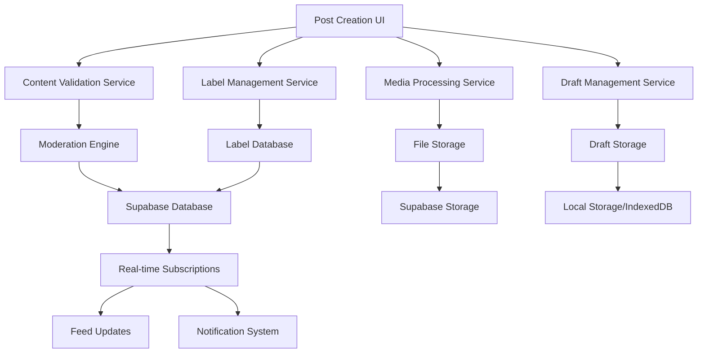
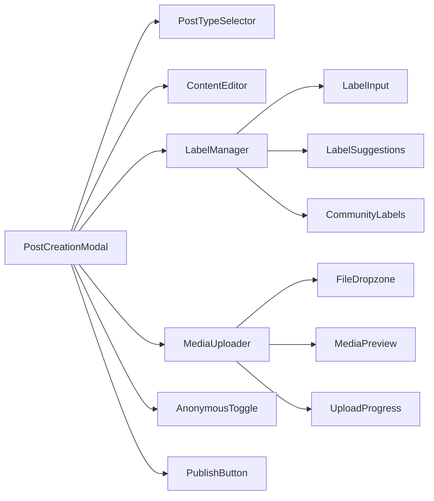

# Post Creation System Design

## Overview

The Post Creation System is designed as a confidence-building, flexible content sharing platform that empowers students to authentically express their academic journey. The system combines user-generated labeling (inspired by Reddit's flair system) with encouraging UX patterns and robust technical infrastructure to create a safe space for student expression.

## Architecture

### System Architecture Overview



### Component Architecture



## Components and Interfaces

### Core Components

#### 1. PostCreationModal Component
```typescript
interface PostCreationModalProps {
  isOpen: boolean;
  onClose: () => void;
  communityId?: string;
  initialType?: PostType;
  draftId?: string;
}

interface PostCreationState {
  content: string;
  labels: Label[];
  mediaFiles: MediaFile[];
  isAnonymous: boolean;
  postType: PostType | null;
  isDraft: boolean;
  isPublishing: boolean;
}
```

**Design Decisions:**
- Modal-based design for focused creation experience
- Auto-save every 30 seconds to prevent data loss
- Campus Confidence integration with encouraging messaging
- Mobile-first responsive design with touch optimization

#### 2. LabelManager Component
```typescript
interface Label {
  id: string;
  text: string;
  type: 'core' | 'community' | 'custom';
  color: string;
  communityId?: string;
  usageCount: number;
  createdBy?: string;
}

interface LabelManagerProps {
  selectedLabels: Label[];
  onLabelsChange: (labels: Label[]) => void;
  communityId?: string;
  maxLabels: number; // Default: 5
}
```

**Design Decisions:**
- Multi-select interface with visual label chips
- Auto-complete with fuzzy search and popularity ranking
- Community-specific suggestions prioritized
- Visual distinction between core, community, and custom labels

#### 3. ContentEditor Component
```typescript
interface ContentEditorProps {
  value: string;
  onChange: (content: string) => void;
  postType: PostType | null;
  placeholder: string;
  maxLength: number; // Default: 5000
}

interface ContentTemplate {
  type: PostType;
  title: string;
  placeholder: string;
  prompts: string[];
}
```

**Design Decisions:**
- Rich text editor with markdown support
- Type-specific templates and prompts
- Character count with encouraging messaging
- Auto-save with visual indicators

#### 4. MediaUploader Component
```typescript
interface MediaFile {
  id: string;
  file: File;
  type: 'image' | 'video' | 'document';
  url?: string;
  thumbnail?: string;
  uploadProgress: number;
  status: 'pending' | 'uploading' | 'processing' | 'complete' | 'error';
}

interface MediaUploaderProps {
  files: MediaFile[];
  onFilesChange: (files: MediaFile[]) => void;
  maxFiles: number; // Default: 5
  maxFileSize: number; // Default: 10MB
}
```

**Design Decisions:**
- Drag-and-drop interface with visual feedback
- Progress indicators with encouraging messages
- Automatic optimization and thumbnail generation
- Error handling with retry mechanisms

### Data Models

#### Post Model
```typescript
interface Post {
  id: string;
  userId: string;
  content: string;
  labels: Label[];
  mediaUrls: string[];
  isAnonymous: boolean;
  communityId?: string;
  guildId?: string;
  createdAt: Date;
  updatedAt: Date;
  status: 'draft' | 'published' | 'moderated' | 'removed';
  moderationFlags?: ModerationFlag[];
}
```

#### Draft Model
```typescript
interface Draft {
  id: string;
  userId: string;
  content: string;
  labels: Label[];
  mediaFiles: MediaFile[];
  isAnonymous: boolean;
  communityId?: string;
  lastSaved: Date;
  expiresAt: Date;
}
```

#### Label Analytics Model
```typescript
interface LabelAnalytics {
  labelId: string;
  usageCount: number;
  communityUsage: Record<string, number>;
  trendingScore: number;
  lastUsed: Date;
  createdAt: Date;
}
```

## User Experience Design

### Campus Confidence Integration

#### Encouraging Messaging System
```typescript
interface EncouragingMessage {
  trigger: 'start' | 'typing' | 'preview' | 'publish' | 'error';
  messages: string[];
  animation?: 'fade' | 'bounce' | 'slide';
}

const ENCOURAGING_MESSAGES: Record<string, EncouragingMessage> = {
  start: {
    trigger: 'start',
    messages: [
      "Ready to share your awesome work? ✨",
      "Your journey matters - let's share it! 🚀",
      "Time to celebrate your progress! 🎉"
    ],
    animation: 'fade'
  },
  // ... more messages
};
```

#### Micro-Animations
- **Label Selection**: Gentle bounce animation when labels are added
- **Content Typing**: Subtle progress indicators and encouraging feedback
- **Media Upload**: Smooth progress bars with celebration on completion
- **Publish Success**: Confetti animation with achievement messaging

#### Accessibility Features
- **Screen Reader Support**: Comprehensive ARIA labels and live regions
- **Keyboard Navigation**: Full keyboard support with visible focus indicators
- **High Contrast Mode**: WCAG 2.1 AA compliant color schemes
- **Voice Input**: Integration with browser speech recognition APIs

### Mobile-First Design Patterns

#### Touch Optimization
```css
/* Touch-friendly button sizing */
.touch-target {
  min-height: 44px;
  min-width: 44px;
  padding: 12px 16px;
}

/* Gesture support */
.swipe-enabled {
  touch-action: pan-y;
  -webkit-overflow-scrolling: touch;
}
```

#### Responsive Layout
- **Mobile**: Single-column layout with bottom sheet modals
- **Tablet**: Two-column layout with sidebar for labels and media
- **Desktop**: Multi-panel layout with enhanced features

## Technical Implementation

### Frontend Architecture

#### State Management (Zustand)
```typescript
interface PostCreationStore {
  // State
  currentDraft: Draft | null;
  isCreating: boolean;
  availableLabels: Label[];
  communityLabels: Record<string, Label[]>;
  
  // Actions
  createPost: (postData: CreatePostData) => Promise<void>;
  saveDraft: (draftData: DraftData) => Promise<void>;
  loadDraft: (draftId: string) => Promise<void>;
  updateLabels: (labels: Label[]) => void;
  uploadMedia: (files: File[]) => Promise<MediaFile[]>;
}
```

#### API Integration
```typescript
// Post creation service
class PostCreationService {
  async createPost(postData: CreatePostData): Promise<Post> {
    // Validate content
    await this.validateContent(postData.content);
    
    // Process media uploads
    const mediaUrls = await this.processMediaFiles(postData.mediaFiles);
    
    // Create post in database
    const post = await supabase
      .from('posts')
      .insert({
        ...postData,
        media_urls: mediaUrls,
        status: 'published'
      })
      .select()
      .single();
    
    // Trigger notifications
    await this.triggerNotifications(post);
    
    return post;
  }
  
  async suggestLabels(content: string, communityId?: string): Promise<Label[]> {
    // AI-powered label suggestions based on content analysis
    const suggestions = await this.analyzeContent(content);
    
    // Community-specific labels
    if (communityId) {
      const communityLabels = await this.getCommunityLabels(communityId);
      suggestions.unshift(...communityLabels);
    }
    
    return suggestions.slice(0, 10);
  }
}
```

### Backend Architecture

#### Database Schema
```sql
-- Posts table
CREATE TABLE posts (
  id UUID DEFAULT gen_random_uuid() PRIMARY KEY,
  user_id UUID REFERENCES profiles(id) NOT NULL,
  content TEXT NOT NULL,
  labels JSONB DEFAULT '[]',
  media_urls JSONB DEFAULT '[]',
  is_anonymous BOOLEAN DEFAULT FALSE,
  community_id UUID REFERENCES communities(id),
  guild_id UUID REFERENCES guilds(id),
  created_at TIMESTAMPTZ DEFAULT NOW(),
  updated_at TIMESTAMPTZ DEFAULT NOW(),
  status post_status DEFAULT 'published'
);

-- Labels table
CREATE TABLE labels (
  id UUID DEFAULT gen_random_uuid() PRIMARY KEY,
  text TEXT UNIQUE NOT NULL,
  type label_type DEFAULT 'custom',
  color TEXT DEFAULT '#6B7280',
  community_id UUID REFERENCES communities(id),
  created_by UUID REFERENCES profiles(id),
  usage_count INTEGER DEFAULT 0,
  is_active BOOLEAN DEFAULT TRUE,
  created_at TIMESTAMPTZ DEFAULT NOW()
);

-- Post labels junction table
CREATE TABLE post_labels (
  post_id UUID REFERENCES posts(id) ON DELETE CASCADE,
  label_id UUID REFERENCES labels(id) ON DELETE CASCADE,
  PRIMARY KEY (post_id, label_id)
);

-- Drafts table
CREATE TABLE drafts (
  id UUID DEFAULT gen_random_uuid() PRIMARY KEY,
  user_id UUID REFERENCES profiles(id) NOT NULL,
  content TEXT,
  labels JSONB DEFAULT '[]',
  media_files JSONB DEFAULT '[]',
  is_anonymous BOOLEAN DEFAULT FALSE,
  community_id UUID REFERENCES communities(id),
  last_saved TIMESTAMPTZ DEFAULT NOW(),
  expires_at TIMESTAMPTZ DEFAULT (NOW() + INTERVAL '30 days')
);
```

#### Row Level Security Policies
```sql
-- Users can create their own posts
CREATE POLICY "Users can create posts" ON posts
  FOR INSERT WITH CHECK (auth.uid() = user_id);

-- Users can view posts in their communities
CREATE POLICY "Users can view community posts" ON posts
  FOR SELECT USING (
    community_id IN (
      SELECT community_id FROM community_members 
      WHERE user_id = auth.uid()
    ) OR user_id = auth.uid()
  );

-- Users can manage their own drafts
CREATE POLICY "Users can manage own drafts" ON drafts
  FOR ALL USING (auth.uid() = user_id);
```

### Real-time Features

#### Live Label Suggestions
```typescript
// Real-time label popularity updates
const subscribeLabelUpdates = (communityId?: string) => {
  return supabase
    .channel(`labels-${communityId || 'global'}`)
    .on('postgres_changes', {
      event: 'UPDATE',
      schema: 'public',
      table: 'labels',
      filter: communityId ? `community_id=eq.${communityId}` : undefined
    }, handleLabelUpdate)
    .subscribe();
};
```

#### Draft Synchronization
```typescript
// Real-time draft sync across devices
const syncDraft = async (draftData: DraftData) => {
  await supabase
    .from('drafts')
    .upsert({
      id: draftData.id,
      user_id: draftData.userId,
      content: draftData.content,
      labels: draftData.labels,
      last_saved: new Date().toISOString()
    });
};
```

## Error Handling

### Content Validation Errors
```typescript
interface ValidationError {
  field: string;
  message: string;
  suggestion?: string;
}

const handleValidationError = (error: ValidationError) => {
  // Show encouraging error message
  showToast({
    type: 'warning',
    title: 'Let\'s improve this together!',
    message: error.message,
    action: error.suggestion ? {
      label: 'Try this',
      onClick: () => applySuggestion(error.suggestion)
    } : undefined
  });
};
```

### Media Upload Errors
```typescript
const handleUploadError = (file: MediaFile, error: Error) => {
  // Provide helpful error recovery
  updateFileStatus(file.id, 'error');
  
  showErrorDialog({
    title: 'Upload hiccup - no worries!',
    message: `We couldn't upload ${file.file.name}. Let's try again.`,
    actions: [
      { label: 'Retry Upload', onClick: () => retryUpload(file) },
      { label: 'Choose Different File', onClick: () => replaceFile(file) },
      { label: 'Continue Without File', onClick: () => removeFile(file) }
    ]
  });
};
```

## Testing Strategy

### Unit Testing
- **Component Testing**: React Testing Library for all UI components
- **Service Testing**: Jest for API services and business logic
- **Accessibility Testing**: axe-core for automated accessibility checks

### Integration Testing
- **API Integration**: Test post creation flow end-to-end
- **Real-time Features**: Test draft sync and label updates
- **Media Processing**: Test upload, optimization, and storage

### User Experience Testing
- **Usability Testing**: Regular testing with actual students
- **Accessibility Testing**: Testing with screen readers and assistive technologies
- **Performance Testing**: Load testing for concurrent post creation

## Performance Optimization

### Frontend Optimization
- **Code Splitting**: Lazy load post creation modal
- **Image Optimization**: WebP format with fallbacks
- **Caching**: Cache label suggestions and community data
- **Debouncing**: Debounce auto-save and label search

### Backend Optimization
- **Database Indexing**: Optimize queries for label suggestions and post retrieval
- **Caching**: Redis cache for popular labels and community data
- **Media Processing**: Background job queue for media optimization
- **Rate Limiting**: Prevent spam and abuse while maintaining usability

This design document provides a comprehensive foundation for implementing a post creation system that empowers authentic student expression while maintaining technical excellence and user safety.