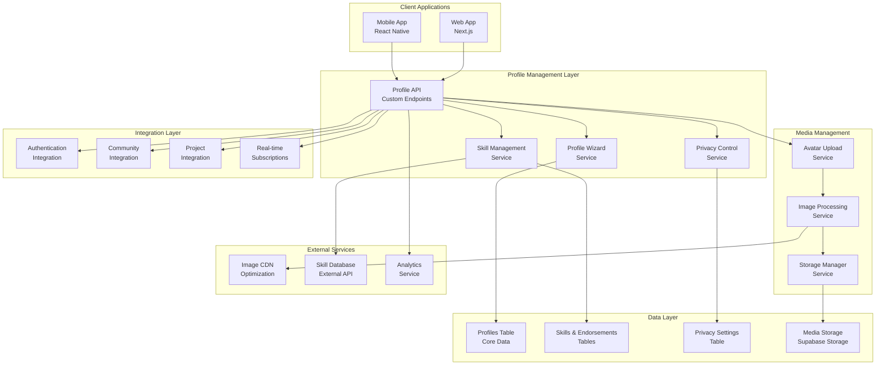

# Profile Management Design Document

## Overview

The Profile Management system is designed as a comprehensive student identity platform that balances self-expression with privacy, confidence-building with authenticity, and ease-of-use with powerful features. Built on Supabase's robust infrastructure, the system provides real-time updates, secure file storage, and seamless integration with Ascend's broader ecosystem while maintaining a student-first design philosophy that encourages authentic sharing and meaningful connections.

## Architecture

### System Architecture Overview



### Profile Management Architecture

The profile system follows a layered architecture with clear separation of concerns:

1. **Presentation Layer**: Mobile and web clients optimized for student experience
2. **Service Layer**: Specialized services for profile creation, editing, privacy, and skills
3. **Media Layer**: Comprehensive image and file management with optimization
4. **Data Layer**: Secure storage with real-time capabilities
5. **Integration Layer**: Seamless connection with other platform features

## Components and Interfaces

### Core Profile Components

#### 1. Profile Management Controller
```typescript
interface ProfileController {
  // Profile CRUD operations
  createProfile(userId: string, profileData: CreateProfileRequest): Promise<ProfileResponse>;
  getProfile(profileId: string, viewerId?: string): Promise<ProfileResponse>;
  updateProfile(profileId: string, updates: UpdateProfileRequest): Promise<ProfileResponse>;
  deleteProfile(profileId: string): Promise<void>;
  
  // Profile wizard flow
  initializeWizard(userId: string): Promise<WizardState>;
  updateWizardStep(userId: string, step: WizardStep, data: any): Promise<WizardState>;
  completeWizard(userId: string): Promise<ProfileResponse>;
  
  // Profile analytics
  getProfileAnalytics(profileId: string): Promise<ProfileAnalytics>;
  getProfileViews(profileId: string, timeRange: TimeRange): Promise<ViewAnalytics>;
}
```

#### 2. Profile Wizard Service
```typescript
interface ProfileWizardService {
  getWizardSteps(userRole: UserRole): Promise<WizardStep[]>;
  validateStepData(step: WizardStep, data: any): Promise<ValidationResult>;
  calculateProgress(userId: string): Promise<ProgressInfo>;
  generateSuggestions(step: WizardStep, userData: any): Promise<Suggestion[]>;
  saveStepProgress(userId: string, step: WizardStep, data: any): Promise<void>;
}

interface WizardStep {
  id: string;
  title: string;
  description: string;
  required: boolean;
  order: number;
  fields: FormField[];
  validationRules: ValidationRule[];
  suggestions?: SuggestionConfig;
}
```

#### 3. Skill Management Service
```typescript
interface SkillManagementService {
  searchSkills(query: string, category?: SkillCategory): Promise<Skill[]>;
  addSkillToProfile(profileId: string, skill: SkillInput): Promise<ProfileSkill>;
  removeSkillFromProfile(profileId: string, skillId: string): Promise<void>;
  updateSkillProficiency(profileId: string, skillId: string, level: ProficiencyLevel): Promise<void>;
  getSkillEndorsements(profileId: string, skillId: string): Promise<Endorsement[]>;
  endorseSkill(endorserId: string, profileId: string, skillId: string, context: string): Promise<Endorsement>;
  suggestSkillsFromProjects(profileId: string): Promise<SkillSuggestion[]>;
  categorizeSkills(skills: Skill[]): Promise<CategorizedSkills>;
}

interface Skill {
  id: string;
  name: string;
  category: SkillCategory;
  description?: string;
  relatedSkills: string[];
  popularity: number;
  verified: boolean;
}

enum SkillCategory {
  TECHNICAL = 'technical',
  SOFT_SKILLS = 'soft_skills',
  ACADEMIC = 'academic',
  CREATIVE = 'creative',
  LEADERSHIP = 'leadership',
  LANGUAGE = 'language'
}
```

#### 4. Avatar Management Service
```typescript
interface AvatarManagementService {
  uploadAvatar(userId: string, file: File): Promise<AvatarUploadResult>;
  cropAvatar(userId: string, cropData: CropData): Promise<AvatarResult>;
  generateDefaultAvatar(userId: string, options: DefaultAvatarOptions): Promise<AvatarResult>;
  deleteAvatar(userId: string): Promise<void>;
  getAvatarVariants(userId: string): Promise<AvatarVariants>;
  optimizeAvatar(imageData: Buffer): Promise<OptimizedImage>;
}

interface AvatarUploadResult {
  success: boolean;
  avatarUrl?: string;
  thumbnailUrl?: string;
  cropSuggestions?: CropSuggestion[];
  error?: string;
}

interface CropData {
  x: number;
  y: number;
  width: number;
  height: number;
  scale: number;
}
```

#### 5. Privacy Control Service
```typescript
interface PrivacyControlService {
  getPrivacySettings(profileId: string): Promise<PrivacySettings>;
  updatePrivacySettings(profileId: string, settings: PrivacySettingsUpdate): Promise<PrivacySettings>;
  checkViewPermission(viewerId: string, profileId: string, field: ProfileField): Promise<boolean>;
  getVisibleProfile(viewerId: string, profileId: string): Promise<FilteredProfile>;
  getPrivacyRecommendations(profileId: string): Promise<PrivacyRecommendation[]>;
}

interface PrivacySettings {
  profileVisibility: VisibilityLevel;
  fieldVisibility: Record<ProfileField, VisibilityLevel>;
  contactPermissions: ContactPermissions;
  searchVisibility: boolean;
  analyticsOptIn: boolean;
}

enum VisibilityLevel {
  PUBLIC = 'public',
  STUDENTS_ONLY = 'students_only',
  COMMUNITIES_ONLY = 'communities_only',
  CONNECTIONS_ONLY = 'connections_only',
  PRIVATE = 'private'
}
```

### User Interface Components

#### 1. Profile Creation Wizard (Mobile)
```typescript
interface ProfileWizardScreens {
  WelcomeScreen: React.FC<WelcomeScreenProps>;
  BasicInfoScreen: React.FC<BasicInfoProps>;
  AcademicInfoScreen: React.FC<AcademicInfoProps>;
  SkillSelectionScreen: React.FC<SkillSelectionProps>;
  AvatarUploadScreen: React.FC<AvatarUploadProps>;
  BioCreationScreen: React.FC<BioCreationProps>;
  PrivacySettingsScreen: React.FC<PrivacySettingsProps>;
  CompletionScreen: React.FC<CompletionScreenProps>;
}

interface BasicInfoProps {
  onNext: (data: BasicInfo) => void;
  onBack: () => void;
  initialData?: BasicInfo;
  validationErrors?: ValidationError[];
  isLoading: boolean;
}
```

#### 2. Profile Editing Components
```typescript
interface ProfileEditingComponents {
  ProfileEditModal: React.FC<ProfileEditModalProps>;
  InlineFieldEditor: React.FC<InlineEditorProps>;
  SkillManager: React.FC<SkillManagerProps>;
  AvatarEditor: React.FC<AvatarEditorProps>;
  PrivacyControls: React.FC<PrivacyControlsProps>;
  BioEditor: React.FC<BioEditorProps>;
}

interface InlineEditorProps {
  field: ProfileField;
  value: any;
  onSave: (value: any) => Promise<void>;
  onCancel: () => void;
  validationRules: ValidationRule[];
  placeholder?: string;
}
```

#### 3. Profile Display Components
```typescript
interface ProfileDisplayComponents {
  ProfileCard: React.FC<ProfileCardProps>;
  ProfileHeader: React.FC<ProfileHeaderProps>;
  SkillTags: React.FC<SkillTagsProps>;
  ProfileBadges: React.FC<ProfileBadgesProps>;
  ProfileStats: React.FC<ProfileStatsProps>;
  ProfileActions: React.FC<ProfileActionsProps>;
}

interface ProfileCardProps {
  profile: Profile;
  viewerRole: UserRole;
  showActions?: boolean;
  compact?: boolean;
  onConnect?: () => void;
  onMessage?: () => void;
}
```

## Data Models

### Core Profile Data Structure

#### 1. Enhanced Profiles Table
```sql
CREATE TABLE profiles (
  id UUID REFERENCES auth.users PRIMARY KEY,
  email TEXT UNIQUE,
  name TEXT NOT NULL,
  display_name TEXT, -- Optional display name different from real name
  bio TEXT,
  avatar_url TEXT,
  avatar_thumbnail_url TEXT,
  role user_role NOT NULL DEFAULT 'student',
  
  -- Academic Information
  college_id UUID REFERENCES guilds(id),
  graduation_year INTEGER,
  field_of_study TEXT,
  academic_level academic_level DEFAULT 'undergraduate',
  gpa DECIMAL(3,2), -- Optional, privacy-controlled
  
  -- Profile Completion and Status
  profile_completion_percentage INTEGER DEFAULT 0,
  wizard_completed BOOLEAN DEFAULT FALSE,
  last_active TIMESTAMPTZ DEFAULT NOW(),
  profile_views_count INTEGER DEFAULT 0,
  
  -- Verification and Trust
  verification_status verification_status DEFAULT 'pending',
  verification_method verification_method DEFAULT 'email',
  trust_score INTEGER DEFAULT 0, -- Based on endorsements and activity
  
  -- Privacy and Preferences
  profile_visibility visibility_level DEFAULT 'students_only',
  searchable BOOLEAN DEFAULT TRUE,
  analytics_opt_in BOOLEAN DEFAULT TRUE,
  
  -- Metadata
  created_at TIMESTAMPTZ DEFAULT NOW(),
  updated_at TIMESTAMPTZ DEFAULT NOW(),
  wizard_started_at TIMESTAMPTZ,
  wizard_completed_at TIMESTAMPTZ
);

CREATE TYPE academic_level AS ENUM ('high_school', 'undergraduate', 'graduate', 'phd', 'postdoc');
CREATE TYPE visibility_level AS ENUM ('public', 'students_only', 'communities_only', 'connections_only', 'private');
```

#### 2. Skills and Endorsements System
```sql
-- Master skills database
CREATE TABLE skills (
  id UUID DEFAULT gen_random_uuid() PRIMARY KEY,
  name TEXT UNIQUE NOT NULL,
  category skill_category NOT NULL,
  description TEXT,
  related_skills UUID[] DEFAULT '{}',
  popularity_score INTEGER DEFAULT 0,
  is_verified BOOLEAN DEFAULT FALSE,
  created_at TIMESTAMPTZ DEFAULT NOW()
);

-- User skills with proficiency
CREATE TABLE profile_skills (
  id UUID DEFAULT gen_random_uuid() PRIMARY KEY,
  profile_id UUID REFERENCES profiles(id) NOT NULL,
  skill_id UUID REFERENCES skills(id) NOT NULL,
  proficiency_level proficiency_level DEFAULT 'beginner',
  self_assessed BOOLEAN DEFAULT TRUE,
  years_experience INTEGER,
  added_at TIMESTAMPTZ DEFAULT NOW(),
  last_used TIMESTAMPTZ,
  
  UNIQUE(profile_id, skill_id)
);

-- Skill endorsements from peers
CREATE TABLE skill_endorsements (
  id UUID DEFAULT gen_random_uuid() PRIMARY KEY,
  endorser_id UUID REFERENCES profiles(id) NOT NULL,
  profile_id UUID REFERENCES profiles(id) NOT NULL,
  skill_id UUID REFERENCES skills(id) NOT NULL,
  project_id UUID REFERENCES projects(id), -- Optional: endorsement tied to specific project
  endorsement_text TEXT,
  strength_rating INTEGER CHECK (strength_rating >= 1 AND strength_rating <= 5),
  created_at TIMESTAMPTZ DEFAULT NOW(),
  
  UNIQUE(endorser_id, profile_id, skill_id)
);

CREATE TYPE skill_category AS ENUM (
  'technical', 'soft_skills', 'academic', 'creative', 
  'leadership', 'language', 'research', 'business'
);

CREATE TYPE proficiency_level AS ENUM ('beginner', 'intermediate', 'advanced', 'expert');
```

#### 3. Privacy Settings Management
```sql
CREATE TABLE profile_privacy_settings (
  profile_id UUID REFERENCES profiles(id) PRIMARY KEY,
  
  -- Overall visibility
  profile_visibility visibility_level DEFAULT 'students_only',
  search_visibility BOOLEAN DEFAULT TRUE,
  
  -- Field-level visibility
  email_visibility visibility_level DEFAULT 'connections_only',
  academic_info_visibility visibility_level DEFAULT 'students_only',
  skills_visibility visibility_level DEFAULT 'students_only',
  bio_visibility visibility_level DEFAULT 'students_only',
  contact_info_visibility visibility_level DEFAULT 'connections_only',
  project_visibility visibility_level DEFAULT 'students_only',
  
  -- Contact permissions
  allow_messages BOOLEAN DEFAULT TRUE,
  allow_collaboration_requests BOOLEAN DEFAULT TRUE,
  allow_skill_endorsements BOOLEAN DEFAULT TRUE,
  allow_recruiter_contact BOOLEAN DEFAULT FALSE,
  
  -- Data preferences
  analytics_opt_in BOOLEAN DEFAULT TRUE,
  marketing_opt_in BOOLEAN DEFAULT FALSE,
  research_participation BOOLEAN DEFAULT FALSE,
  
  updated_at TIMESTAMPTZ DEFAULT NOW()
);
```

#### 4. Profile Wizard Progress
```sql
CREATE TABLE profile_wizard_progress (
  id UUID DEFAULT gen_random_uuid() PRIMARY KEY,
  profile_id UUID REFERENCES profiles(id) NOT NULL,
  current_step TEXT NOT NULL,
  completed_steps JSONB DEFAULT '[]',
  step_data JSONB DEFAULT '{}',
  started_at TIMESTAMPTZ DEFAULT NOW(),
  last_updated TIMESTAMPTZ DEFAULT NOW(),
  completed_at TIMESTAMPTZ,
  
  UNIQUE(profile_id)
);
```

#### 5. Profile Analytics and Insights
```sql
CREATE TABLE profile_views (
  id UUID DEFAULT gen_random_uuid() PRIMARY KEY,
  profile_id UUID REFERENCES profiles(id) NOT NULL,
  viewer_id UUID REFERENCES profiles(id), -- Null for anonymous views
  view_source TEXT, -- 'search', 'community', 'project', 'direct'
  viewed_at TIMESTAMPTZ DEFAULT NOW(),
  session_duration INTEGER, -- Seconds spent viewing
  
  -- Prevent spam views
  UNIQUE(profile_id, viewer_id, DATE(viewed_at))
);

CREATE TABLE profile_interactions (
  id UUID DEFAULT gen_random_uuid() PRIMARY KEY,
  profile_id UUID REFERENCES profiles(id) NOT NULL,
  interactor_id UUID REFERENCES profiles(id) NOT NULL,
  interaction_type interaction_type NOT NULL,
  interaction_data JSONB,
  created_at TIMESTAMPTZ DEFAULT NOW()
);

CREATE TYPE interaction_type AS ENUM (
  'profile_view', 'skill_endorsement', 'collaboration_request', 
  'message_sent', 'connection_request', 'project_invitation'
);
```

### Media Storage Structure

#### 1. Avatar Management
```sql
CREATE TABLE profile_avatars (
  id UUID DEFAULT gen_random_uuid() PRIMARY KEY,
  profile_id UUID REFERENCES profiles(id) NOT NULL,
  original_url TEXT NOT NULL,
  thumbnail_url TEXT NOT NULL,
  medium_url TEXT,
  large_url TEXT,
  file_size INTEGER NOT NULL,
  mime_type TEXT NOT NULL,
  width INTEGER NOT NULL,
  height INTEGER NOT NULL,
  upload_source TEXT DEFAULT 'manual', -- 'manual', 'camera', 'social'
  is_active BOOLEAN DEFAULT TRUE,
  created_at TIMESTAMPTZ DEFAULT NOW(),
  
  UNIQUE(profile_id, is_active) WHERE is_active = TRUE
);
```

#### 2. Supabase Storage Buckets Configuration
```typescript
// Storage bucket configuration
const storageBuckets = {
  avatars: {
    public: true,
    allowedMimeTypes: ['image/jpeg', 'image/png', 'image/webp'],
    fileSizeLimit: 5 * 1024 * 1024, // 5MB
    imageTransformation: {
      resize: [
        { name: 'thumbnail', width: 64, height: 64 },
        { name: 'medium', width: 200, height: 200 },
        { name: 'large', width: 400, height: 400 }
      ],
      format: 'webp',
      quality: 85
    }
  }
};
```

## Error Handling

### Profile Management Error Classification

#### 1. Validation Errors
```typescript
enum ProfileValidationError {
  INVALID_EMAIL_FORMAT = 'INVALID_EMAIL_FORMAT',
  NAME_TOO_SHORT = 'NAME_TOO_SHORT',
  BIO_TOO_LONG = 'BIO_TOO_LONG',
  INVALID_GRADUATION_YEAR = 'INVALID_GRADUATION_YEAR',
  UNSUPPORTED_IMAGE_FORMAT = 'UNSUPPORTED_IMAGE_FORMAT',
  IMAGE_TOO_LARGE = 'IMAGE_TOO_LARGE',
  SKILL_NOT_FOUND = 'SKILL_NOT_FOUND',
  DUPLICATE_SKILL = 'DUPLICATE_SKILL'
}
```

#### 2. Privacy and Permission Errors
```typescript
enum PrivacyError {
  INSUFFICIENT_PERMISSIONS = 'INSUFFICIENT_PERMISSIONS',
  PROFILE_NOT_VISIBLE = 'PROFILE_NOT_VISIBLE',
  FIELD_NOT_ACCESSIBLE = 'FIELD_NOT_ACCESSIBLE',
  PRIVACY_SETTING_INVALID = 'PRIVACY_SETTING_INVALID'
}
```

#### 3. Media Upload Errors
```typescript
enum MediaError {
  UPLOAD_FAILED = 'UPLOAD_FAILED',
  PROCESSING_FAILED = 'PROCESSING_FAILED',
  STORAGE_QUOTA_EXCEEDED = 'STORAGE_QUOTA_EXCEEDED',
  INVALID_IMAGE_DIMENSIONS = 'INVALID_IMAGE_DIMENSIONS',
  VIRUS_DETECTED = 'VIRUS_DETECTED'
}
```

### Error Recovery Strategies

#### 1. Graceful Degradation
- **Avatar Upload Failures**: Fall back to default avatars or initials
- **Skill Service Unavailable**: Allow manual skill entry with later validation
- **Real-time Updates Failed**: Queue updates for retry with user notification

#### 2. User-Friendly Recovery
- **Validation Errors**: Inline guidance with specific correction suggestions
- **Upload Failures**: Alternative upload methods and format conversion
- **Privacy Conflicts**: Clear explanations and recommended settings

## Testing Strategy

### Unit Testing Approach

#### 1. Service Layer Testing
```typescript
describe('ProfileWizardService', () => {
  describe('calculateProgress', () => {
    it('should calculate correct completion percentage', async () => {
      const progress = await wizardService.calculateProgress('user-id');
      expect(progress.percentage).toBe(60);
      expect(progress.completedSteps).toHaveLength(3);
      expect(progress.nextStep).toBe('skill-selection');
    });
  });
  
  describe('validateStepData', () => {
    it('should validate basic info step correctly', async () => {
      const result = await wizardService.validateStepData('basic-info', {
        name: 'John Doe',
        email: 'john@college.edu'
      });
      expect(result.isValid).toBe(true);
    });
  });
});
```

#### 2. Privacy Control Testing
```typescript
describe('PrivacyControlService', () => {
  it('should respect field-level visibility settings', async () => {
    const visibleProfile = await privacyService.getVisibleProfile('viewer-id', 'profile-id');
    expect(visibleProfile.email).toBeUndefined(); // Email hidden
    expect(visibleProfile.name).toBeDefined(); // Name visible
  });
});
```

### Integration Testing

#### 1. Profile Creation Flow Testing
```typescript
describe('Complete Profile Creation Flow', () => {
  it('should create profile through wizard successfully', async () => {
    // Initialize wizard
    const wizardState = await request(app)
      .post('/api/v1/profiles/wizard/init')
      .set('Authorization', `Bearer ${token}`);
    
    // Complete basic info step
    await request(app)
      .post('/api/v1/profiles/wizard/step')
      .send({
        step: 'basic-info',
        data: { name: 'Test User', bio: 'Test bio' }
      });
    
    // Complete wizard
    const profile = await request(app)
      .post('/api/v1/profiles/wizard/complete');
    
    expect(profile.body.success).toBe(true);
    expect(profile.body.data.wizard_completed).toBe(true);
  });
});
```

### End-to-End Testing

#### 1. User Journey Testing
- Complete profile creation wizard from start to finish
- Profile editing with real-time updates
- Privacy settings changes and their effects
- Avatar upload and cropping functionality
- Skill management and endorsement flows

#### 2. Cross-Platform Testing
- Consistent experience between mobile and web
- Real-time synchronization across devices
- Offline functionality and sync recovery

## Security Considerations

### Data Protection Measures

#### 1. Privacy by Design
- **Default Privacy**: New profiles default to student-only visibility
- **Granular Controls**: Field-level privacy settings with clear explanations
- **Data Minimization**: Only collect necessary information with clear purpose
- **Consent Management**: Explicit opt-in for analytics and research participation

#### 2. Secure File Handling
- **Upload Validation**: Comprehensive file type and size validation
- **Virus Scanning**: Automated scanning of all uploaded files
- **Content Moderation**: AI-powered screening of profile images and text
- **Secure Storage**: Encrypted storage with access controls

#### 3. Access Control
- **Row Level Security**: Supabase RLS policies for profile data access
- **API Authentication**: Bearer token validation on all endpoints
- **Permission Checking**: Real-time permission validation for profile access
- **Audit Logging**: Comprehensive logging of profile access and modifications

### Privacy Compliance

#### 1. GDPR Compliance
- **Data Subject Rights**: Full implementation of access, rectification, erasure, and portability
- **Consent Management**: Granular consent tracking and management
- **Data Processing Records**: Comprehensive documentation of data processing activities
- **Privacy Impact Assessments**: Regular assessments for new features

#### 2. Student Data Protection
- **FERPA Considerations**: Appropriate handling of educational records
- **Age Verification**: Enhanced protection for users under 18
- **Parental Controls**: Where applicable, parental consent mechanisms
- **Data Retention**: Automatic cleanup of unnecessary data

## Performance Optimization

### Database Optimization

#### 1. Indexing Strategy
```sql
-- Essential indexes for profile queries
CREATE INDEX idx_profiles_college_id ON profiles(college_id);
CREATE INDEX idx_profiles_graduation_year ON profiles(graduation_year);
CREATE INDEX idx_profiles_visibility ON profiles(profile_visibility);
CREATE INDEX idx_profiles_searchable ON profiles(searchable) WHERE searchable = TRUE;

-- Skill-related indexes
CREATE INDEX idx_profile_skills_profile_id ON profile_skills(profile_id);
CREATE INDEX idx_profile_skills_skill_id ON profile_skills(skill_id);
CREATE INDEX idx_skills_category ON skills(category);
CREATE INDEX idx_skills_popularity ON skills(popularity_score DESC);

-- Full-text search for profiles
CREATE INDEX idx_profiles_search ON profiles USING gin(
  to_tsvector('english', name || ' ' || COALESCE(bio, '') || ' ' || COALESCE(field_of_study, ''))
);
```

#### 2. Query Optimization
```typescript
// Optimized profile loading with selective field loading
const getProfileForViewer = async (profileId: string, viewerId: string) => {
  const { data, error } = await supabase
    .from('profiles')
    .select(`
      id, name, display_name, bio, avatar_url,
      college_id, graduation_year, field_of_study,
      profile_skills!inner(
        skill_id,
        proficiency_level,
        skills(name, category)
      )
    `)
    .eq('id', profileId)
    .single();
    
  // Apply privacy filtering based on viewer permissions
  return filterProfileByPrivacy(data, viewerId);
};
```

### Caching Strategy

#### 1. Profile Data Caching
```typescript
// Redis-like caching for frequently accessed profiles
const getCachedProfile = async (profileId: string, viewerId: string) => {
  const cacheKey = `profile:${profileId}:viewer:${viewerId}`;
  
  // Check cache first
  const cached = await supabase
    .from('profile_cache')
    .select('data, expires_at')
    .eq('cache_key', cacheKey)
    .single();
    
  if (cached.data && new Date(cached.data.expires_at) > new Date()) {
    return cached.data.data;
  }
  
  // Generate fresh data and cache
  const freshProfile = await generateProfileForViewer(profileId, viewerId);
  await cacheProfile(cacheKey, freshProfile, 300); // 5 minutes
  
  return freshProfile;
};
```

#### 2. Image Optimization
```typescript
// Automatic image optimization pipeline
const optimizeAvatar = async (imageBuffer: Buffer): Promise<OptimizedImages> => {
  const variants = await Promise.all([
    sharp(imageBuffer).resize(64, 64).webp({ quality: 85 }).toBuffer(),
    sharp(imageBuffer).resize(200, 200).webp({ quality: 85 }).toBuffer(),
    sharp(imageBuffer).resize(400, 400).webp({ quality: 85 }).toBuffer()
  ]);
  
  return {
    thumbnail: variants[0],
    medium: variants[1],
    large: variants[2]
  };
};
```

## Real-Time Features Implementation

### Supabase Real-Time Integration

#### 1. Profile Updates Subscription
```typescript
// Real-time profile updates
const subscribeToProfileUpdates = (profileId: string) => {
  return supabase
    .channel(`profile-${profileId}`)
    .on('postgres_changes', {
      event: 'UPDATE',
      schema: 'public',
      table: 'profiles',
      filter: `id=eq.${profileId}`
    }, handleProfileUpdate)
    .on('postgres_changes', {
      event: '*',
      schema: 'public',
      table: 'profile_skills',
      filter: `profile_id=eq.${profileId}`
    }, handleSkillUpdate)
    .subscribe();
};
```

#### 2. Privacy Settings Real-Time Updates
```typescript
// Real-time privacy changes affecting visibility
const subscribeToPrivacyUpdates = (userId: string) => {
  return supabase
    .channel(`privacy-${userId}`)
    .on('postgres_changes', {
      event: 'UPDATE',
      schema: 'public',
      table: 'profile_privacy_settings',
      filter: `profile_id=eq.${userId}`
    }, (payload) => {
      // Update cached permissions and refresh visible profiles
      invalidateProfileCache(userId);
      notifyConnectedClients(userId, 'privacy_updated');
    })
    .subscribe();
};
```

## Deployment Architecture

### Supabase Configuration

#### 1. Database Setup
```sql
-- Enable necessary extensions
CREATE EXTENSION IF NOT EXISTS "uuid-ossp";
CREATE EXTENSION IF NOT EXISTS "pgcrypto";
CREATE EXTENSION IF NOT EXISTS "pg_trgm"; -- For fuzzy text search

-- Create custom types
CREATE TYPE academic_level AS ENUM ('high_school', 'undergraduate', 'graduate', 'phd', 'postdoc');
CREATE TYPE visibility_level AS ENUM ('public', 'students_only', 'communities_only', 'connections_only', 'private');
CREATE TYPE skill_category AS ENUM ('technical', 'soft_skills', 'academic', 'creative', 'leadership', 'language');
CREATE TYPE proficiency_level AS ENUM ('beginner', 'intermediate', 'advanced', 'expert');

-- Create tables with proper constraints and indexes
-- (Tables created as shown in Data Models section)

-- Enable RLS on all profile-related tables
ALTER TABLE profiles ENABLE ROW LEVEL SECURITY;
ALTER TABLE profile_skills ENABLE ROW LEVEL SECURITY;
ALTER TABLE skill_endorsements ENABLE ROW LEVEL SECURITY;
ALTER TABLE profile_privacy_settings ENABLE ROW LEVEL SECURITY;
```

#### 2. Row Level Security Policies
```sql
-- Users can view profiles based on privacy settings
CREATE POLICY "Users can view profiles based on privacy" ON profiles
  FOR SELECT USING (
    CASE profile_visibility
      WHEN 'public' THEN TRUE
      WHEN 'students_only' THEN auth.uid() IN (
        SELECT id FROM profiles WHERE verification_status = 'verified'
      )
      WHEN 'communities_only' THEN auth.uid() IN (
        SELECT user_id FROM community_members cm
        WHERE cm.community_id IN (
          SELECT community_id FROM community_members WHERE user_id = profiles.id
        )
      )
      WHEN 'connections_only' THEN auth.uid() IN (
        SELECT follower_id FROM user_connections WHERE following_id = profiles.id
        UNION
        SELECT following_id FROM user_connections WHERE follower_id = profiles.id
      )
      ELSE auth.uid() = profiles.id
    END
  );

-- Users can update their own profiles
CREATE POLICY "Users can update own profile" ON profiles
  FOR UPDATE USING (auth.uid() = id);

-- Users can manage their own skills
CREATE POLICY "Users can manage own skills" ON profile_skills
  FOR ALL USING (auth.uid() = profile_id);

-- Users can endorse skills of visible profiles
CREATE POLICY "Users can endorse visible profile skills" ON skill_endorsements
  FOR INSERT WITH CHECK (
    auth.uid() = endorser_id AND
    profile_id IN (
      SELECT id FROM profiles WHERE 
      -- Apply same visibility logic as profile viewing
      CASE profile_visibility
        WHEN 'public' THEN TRUE
        WHEN 'students_only' THEN auth.uid() IN (
          SELECT id FROM profiles WHERE verification_status = 'verified'
        )
        -- ... other visibility levels
        ELSE FALSE
      END
    )
  );
```

#### 3. Edge Functions for Profile Processing
```typescript
// Profile completion calculation edge function
export const calculateProfileCompletion = async (req: Request) => {
  const { profileId } = await req.json();
  
  const supabase = createClient(
    Deno.env.get('SUPABASE_URL') ?? '',
    Deno.env.get('SUPABASE_SERVICE_ROLE_KEY') ?? ''
  );
  
  const { data: profile } = await supabase
    .from('profiles')
    .select('*')
    .eq('id', profileId)
    .single();
    
  const completionScore = calculateCompletion(profile);
  
  await supabase
    .from('profiles')
    .update({ profile_completion_percentage: completionScore })
    .eq('id', profileId);
    
  return new Response(JSON.stringify({ completion: completionScore }));
};

function calculateCompletion(profile: any): number {
  const fields = [
    { field: 'name', weight: 20, required: true },
    { field: 'bio', weight: 15 },
    { field: 'avatar_url', weight: 10 },
    { field: 'field_of_study', weight: 15 },
    { field: 'graduation_year', weight: 10 },
    // Skills checked separately
  ];
  
  let score = 0;
  let totalWeight = 0;
  
  fields.forEach(({ field, weight, required }) => {
    totalWeight += weight;
    if (profile[field] && profile[field].trim() !== '') {
      score += weight;
    } else if (required) {
      // Required fields have higher impact when missing
      score -= weight * 0.5;
    }
  });
  
  // Add skills bonus (up to 30 points)
  const skillsBonus = Math.min(30, (profile.skills_count || 0) * 5);
  score += skillsBonus;
  totalWeight += 30;
  
  return Math.max(0, Math.min(100, Math.round((score / totalWeight) * 100)));
}
```

This comprehensive design document provides the foundation for implementing Ascend's profile management system with a focus on student experience, privacy, and scalability while maintaining the platform's core values of authenticity and confidence-building.