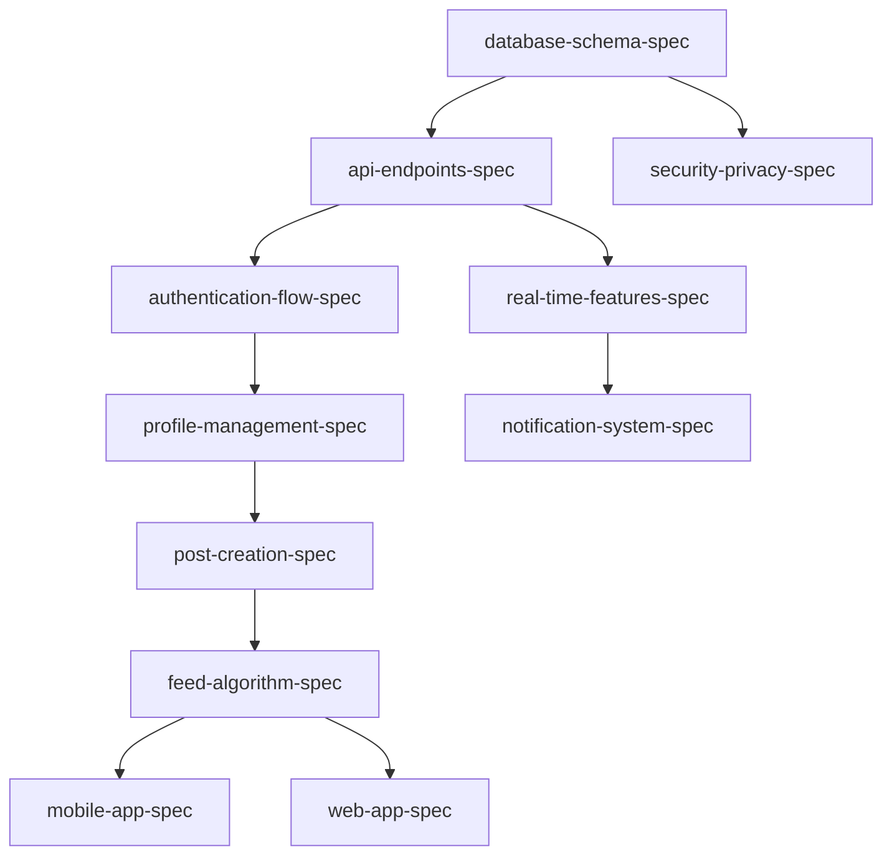

# Ascend Project Specifications Roadmap

This document outlines all the specification files needed to build Ascend, a student-only social network designed to create psychological safety and confidence-building experiences for students. Each specification follows the requirements → design → tasks workflow and must align with the Campus Confidence design philosophy.

## Project Vision & Core Principles

**Mission**: Create a safe, supportive environment where students can confidently share their academic journey, showcase projects, celebrate achievements, and build meaningful cross-college connections without the intimidation factor of professional networks.

**Non-Negotiable Principles**:
- **Student-First Always**: Every decision prioritizes student well-being over business metrics
- **Psychological Safety**: Create spaces where students feel safe to be vulnerable and ask questions
- **Authentic Connection**: Facilitate genuine peer relationships, not superficial networking
- **Verified Student Community**: Maintain strict verification to preserve student-only environment
- **Ethical Design**: No dark patterns, addictive mechanics, or exploitative engagement strategies

## Existing Specifications

### Completed Specs
- `.kiro/specs/ui-mockups-campus-confidence/` - Campus Confidence UI mockup system with psychological safety focus
- `.kiro/specs/campus-confidence-design-system/` - Complete design system with confidence-building components
- `.kiro/steering/ui_mockups_campus_confidence.md` - Comprehensive UI guidelines with accessibility compliance

## Required Specifications by Module

### MODULE 1: Core Identity & Profiles
*Foundation for student-only verified community*

#### 1.1 Authentication & Verification System
**Priority: CRITICAL - Start Here**
**Student Impact**: Ensures safe, verified student-only environment

- `.kiro/specs/authentication-flow-spec/`
  - **Primary**: College email verification workflow with encouraging messaging
  - **Alternative**: College database verification for institutions without email domains
  - **Features**: OAuth integration (Google, GitHub), session management, JWT refresh
  - **UX Focus**: Confidence-building onboarding with clear progress indicators
  - **Security**: Rate limiting, fraud detection, privacy protection
  - **Campus Confidence Integration**: Welcoming animations, supportive error messages

- `.kiro/specs/student-verification-spec/`
  - **Core**: College domain whitelist management and verification status tracking
  - **Innovation**: Dual verification system (email + database) for comprehensive coverage
  - **Trust System**: Verification badges, trust indicators, ongoing maintenance
  - **Edge Cases**: Manual verification, international colleges, transfer students
  - **Privacy**: Anonymous verification options, data minimization
  - **Campus Confidence Integration**: Achievement celebrations for verification completion

#### 1.2 Profile Management System
**Priority: HIGH**
**Student Impact**: Empowers authentic self-expression and skill showcase

- `.kiro/specs/profile-management-spec/`
  - **Progressive Creation**: Wizard-based profile setup with optional steps
  - **Skill System**: Dynamic skill selection with peer endorsements
  - **Privacy Controls**: Granular visibility settings, anonymous options
  - **Portfolio Integration**: Project showcase with media galleries
  - **Campus Confidence Integration**: Encouraging prompts, celebration of profile completion
  - **Accessibility**: Screen reader support, keyboard navigation, high contrast mode

### MODULE 2: The Social Feed & Posts
*Core social interaction and content sharing*

#### 2.1 Content Creation & Management
**Priority: HIGH**
**Student Impact**: Safe space for sharing wins, projects, and questions

- `.kiro/specs/post-creation-spec/`
  - **Flexible Post Labeling**: User-generated labels (like Reddit flair) for authentic categorization
  - **Core Post Types**: Win (achievements), Project Update (progress), Question (help-seeking) as suggested defaults
  - **Multi-Label Support**: Students can apply multiple labels per post for nuanced categorization
  - **Community-Specific Labels**: Communities can create and suggest relevant labels for their topics
  - **Label Discovery**: Auto-suggest popular labels based on content and community context
  - **Anonymous Mode**: Complete privacy protection for vulnerable sharing
  - **Media Support**: Images, videos, documents with automatic optimization
  - **Confidence Building**: Encouraging prompts, templates, success celebrations
  - **Campus Confidence Integration**: Micro-animations, supportive feedback, draft recovery
  - **Moderation**: Real-time content filtering, community guidelines integration

- `.kiro/specs/feed-algorithm-spec/`
  - **Personalization**: Community-based content with skill matching
  - **Quality Focus**: Meaningful engagement over vanity metrics
  - **Real-time Updates**: Live content via Supabase subscriptions
  - **Diversity**: Cross-college content mixing, topic variety
  - **Campus Confidence Integration**: Encouraging content prioritization
  - **Performance**: Infinite scroll, skeleton loading, offline caching

#### 2.2 Social Interactions
**Priority: MEDIUM**
**Student Impact**: Meaningful peer connections and supportive feedback

- `.kiro/specs/interaction-system-spec/`
  - **Kudos System**: Meaningful appreciation with personalized messages
  - **Comment Threading**: Nested discussions with notification management
  - **Sharing**: Cross-platform sharing with privacy controls
  - **Bookmarking**: Save posts for later reference and learning
  - **Campus Confidence Integration**: Celebration animations, encouraging feedback
  - **Real-time**: Live interactions via WebSocket connections

### MODULE 3: Communities & Guilds
*Cross-college connections and college-specific hubs*

#### 3.1 Community System
**Priority: MEDIUM**
**Student Impact**: Cross-college skill-based connections and learning

- `.kiro/specs/community-management-spec/`
  - **Topic-Based**: AI/ML, Finance, Design, etc. with skill matching
  - **Cross-College**: Break down institutional barriers
  - **Moderation**: Community-driven with admin oversight
  - **Discovery**: Intelligent recommendations based on interests
  - **Challenges**: Community-verified skill building activities
  - **Campus Confidence Integration**: Welcoming onboarding, achievement recognition

#### 3.2 College Guild System
**Priority: MEDIUM**
**Student Impact**: Official college representation and aspirant support

- `.kiro/specs/guild-system-spec/`
  - **Official Hubs**: Verified college representation with admin controls
  - **Aspirant Q&A**: Safe space for college-specific questions
  - **Digital Elections**: Transparent student council voting system
  - **Events**: Workshop and event management with RSVP tracking
  - **Institutional Memory**: Knowledge preservation across council transitions
  - **Campus Confidence Integration**: Official verification badges, celebration of participation
  - **Anonymous posting**: anonymously users can ask questions in the guild

#### 3.3 Content Moderation
**Priority: HIGH**
**Student Impact**: Safe, supportive environment free from harassment

- `.kiro/specs/moderation-system-spec/`
  - **AI-Powered**: Automated content filtering with human oversight
  - **Community Reporting**: Easy reporting with clear escalation paths
  - **Crisis Intervention**: Mental health support and resource integration
  - **Protective Moderation**: Supportive rather than punitive approach
  - **Appeal Process**: Fair resolution with learning opportunities
  - **Campus Confidence Integration**: Supportive messaging, educational guidance

### MODULE 4: Project Collaboration & Skills
*Skill development and cross-college collaboration*

#### 4.1 Project System
**Priority: MEDIUM**
**Student Impact**: Real-world collaboration and skill development

- `.kiro/specs/project-collaboration-spec/`
  - **Portfolio Showcase**: Visual project galleries with detailed documentation
  - **Skill Matching**: Find collaborators with complementary skills
  - **Workspace**: Integrated communication and project management tools
  - **Progress Tracking**: Milestone management with celebration of achievements
  - **Campus Confidence Integration**: Collaboration encouragement, success celebrations
  - **Privacy**: Control over project visibility and collaboration requests

#### 4.2 Skill Verification
**Priority: LOW**
**Student Impact**: Credible skill demonstration through real work

- `.kiro/specs/skill-verification-spec/`
  - **Project-Linked**: Skills verified through actual collaborative work
  - **Peer Endorsements**: Community-based skill validation
  - **Challenge System**: Skill assessment through practical challenges
  - **Growth Tracking**: Skill development progression over time
  - **Campus Confidence Integration**: Achievement badges, progress celebrations
  - **Integration**: Connect with recruitment features for career opportunities

### MODULE 5: Advanced Features
*Enhanced discovery and communication*

#### 5.1 Search & Discovery
**Priority: MEDIUM**
**Student Impact**: Find relevant content, people, and opportunities

- `.kiro/specs/search-and-discovery-spec/`
  - **Global Search**: Users, posts, communities, projects with advanced filtering
  - **Smart Recommendations**: AI-powered content and connection suggestions
  - **Faceted Search**: Multiple filter combinations for precise results
  - **Search Analytics**: Track and optimize search effectiveness
  - **Campus Confidence Integration**: Encouraging search suggestions, discovery celebrations
  - **Privacy**: Respect user visibility preferences and anonymous content

#### 5.2 Notification System
**Priority: HIGH**
**Student Impact**: Stay connected without overwhelming interruptions

- `.kiro/specs/notification-system-spec/`
  - **Smart Timing**: Respect study schedules and time zones
  - **Batching**: Group related notifications to reduce interruption
  - **Personalization**: Customizable notification preferences
  - **Multi-Channel**: Push, in-app, email with user control
  - **Campus Confidence Integration**: Encouraging notification copy, celebration alerts
  - **Analytics**: Track engagement and optimize notification effectiveness

#### 5.3 Recruitment Platform (Future)
**Priority: LOW**
**Student Impact**: Career opportunities based on verified skills and projects

- `.kiro/specs/recruitment-platform-spec/`
  - **Recruiter Dashboard**: Advanced candidate search and pipeline management
  - **Skill-Based Matching**: Find candidates with proven project experience
  - **Privacy Controls**: Student control over recruiter visibility
  - **Authentic Portfolios**: Real project work over traditional resumes
  - **Campus Confidence Integration**: Empowering career transition messaging
  - **Analytics**: Recruitment effectiveness and student success tracking

### MODULE 6: Technical Infrastructure
*Robust, scalable, and secure foundation*

#### 6.1 API & Backend
**Priority: CRITICAL**
**Technical Impact**: Foundation for all platform functionality

- `.kiro/specs/api-endpoints-spec/`
  - **RESTful Design**: Consistent endpoint structure with versioning
  - **Supabase Integration**: Leverage PostgreSQL, Auth, Storage, Real-time
  - **Security**: JWT authentication, rate limiting, input validation
  - **Error Handling**: Standardized error responses with helpful messages
  - **Documentation**: Auto-generated API docs with interactive testing
  - **Performance**: Caching strategies, query optimization, pagination

- `.kiro/specs/database-schema-spec/`
  - **PostgreSQL Schema**: Complete table structure with relationships
  - **Row Level Security**: Granular access control at database level
  - **Performance**: Strategic indexing and query optimization
  - **Migration Strategy**: Safe schema changes with rollback procedures
  - **Data Integrity**: Constraints, validation, and consistency checks
  - **Backup & Recovery**: Automated backups with disaster recovery plans

#### 6.2 Real-time Features
**Priority: HIGH**
**Technical Impact**: Live interactions and immediate feedback

- `.kiro/specs/real-time-features-spec/`
  - **Supabase Real-time**: PostgreSQL change data capture
  - **WebSocket Management**: Connection handling and cleanup
  - **Event Types**: Live comments, kudos, notifications, presence
  - **Offline Sync**: Handle disconnections and reconnections gracefully
  - **Performance**: Optimize subscription management and memory usage
  - **Campus Confidence Integration**: Real-time celebration animations

#### 6.3 File Management
**Priority: MEDIUM**
**Technical Impact**: Media handling and storage optimization

- `.kiro/specs/file-upload-spec/`
  - **Multi-Format Support**: Images, videos, documents with validation
  - **Processing Pipeline**: Automatic compression, resizing, format conversion
  - **CDN Integration**: Global content delivery for performance
  - **Security**: Virus scanning, content validation, access controls
  - **Storage Management**: Quota tracking, cleanup, and optimization
  - **Campus Confidence Integration**: Upload progress with encouraging messages

#### 6.4 Security & Privacy
**Priority: CRITICAL**
**Technical Impact**: Student data protection and platform safety

- `.kiro/specs/security-privacy-spec/`
  - **Data Protection**: GDPR compliance, student data privacy
  - **Authentication Security**: Multi-factor auth, session management
  - **Content Security**: XSS protection, CSRF prevention, input sanitization
  - **Privacy Controls**: Granular user privacy settings
  - **Incident Response**: Security breach procedures and communication
  - **Audit Logging**: Comprehensive activity tracking for compliance

### MODULE 7: Platform & Deployment
*Multi-platform delivery and operations*

#### 7.1 Mobile Application
**Priority: HIGH**
**Technical Impact**: Primary platform for student engagement

- `.kiro/specs/mobile-app-spec/`
  - **React Native**: Cross-platform with native performance
  - **Offline Functionality**: Core features work without internet
  - **Push Notifications**: Timely alerts with smart scheduling
  - **Performance**: Optimized for low-end devices and slow networks
  - **App Store**: Deployment, updates, and store optimization
  - **Campus Confidence Integration**: Mobile-optimized confidence-building UX

#### 7.2 Web Application
**Priority: MEDIUM**
**Technical Impact**: Desktop experience and SEO optimization

- `.kiro/specs/web-app-spec/`
  - **Next.js**: Server-side rendering for SEO and performance
  - **Progressive Web App**: Offline capabilities and app-like experience
  - **Desktop Features**: Keyboard shortcuts, multi-window support
  - **SEO Optimization**: Public profiles discoverable by search engines
  - **Cross-Platform**: Consistent experience with mobile app
  - **Campus Confidence Integration**: Desktop-optimized confidence-building features

#### 7.3 DevOps & Monitoring
**Priority: MEDIUM**
**Technical Impact**: Reliable operations and continuous improvement

- `.kiro/specs/devops-monitoring-spec/`
  - **CI/CD Pipeline**: Automated testing, building, and deployment
  - **Environment Management**: Development, staging, production environments
  - **Monitoring**: Application performance, error tracking, user analytics
  - **Alerting**: Proactive issue detection and notification
  - **Scaling**: Auto-scaling based on demand and performance metrics
  - **Quality Assurance**: Automated testing, code quality, security scanning

## Implementation Priority Matrix

### Phase 1: Foundation (Weeks 1-6)
**CRITICAL - Must complete before other work**
*Establishes secure, verified student-only environment*

1. `authentication-flow-spec/` - Student verification and secure access
2. `student-verification-spec/` - College domain and database verification
3. `database-schema-spec/` - Core data structure and relationships
4. `api-endpoints-spec/` - Backend API foundation
5. `security-privacy-spec/` - Student data protection and safety
6. `profile-management-spec/` - Student identity and self-expression

**Success Criteria**: Students can securely sign up, verify college status, and create profiles

### Phase 2: Core Social Features (Weeks 7-12)
**HIGH - Core user experience and engagement**
*Enables confident sharing and meaningful interactions*

1. `post-creation-spec/` - Win, project, and question sharing
2. `feed-algorithm-spec/` - Personalized content discovery
3. `interaction-system-spec/` - Kudos, comments, and social engagement
4. `notification-system-spec/` - Timely and relevant alerts
5. `moderation-system-spec/` - Safe and supportive environment
6. `real-time-features-spec/` - Live interactions and immediate feedback
7. `mobile-app-spec/` - Primary platform for student engagement

**Success Criteria**: Students actively share content, engage with peers, and feel safe in the community

### Phase 3: Community Features (Weeks 13-18)
**MEDIUM - Community building and cross-college connections**
*Facilitates meaningful connections and collaborative learning*

1. `community-management-spec/` - Topic-based cross-college groups
2. `guild-system-spec/` - Official college hubs and aspirant support
3. `search-and-discovery-spec/` - Find relevant content and connections
4. `file-upload-spec/` - Rich media sharing and portfolio building
5. `web-app-spec/` - Desktop experience and SEO optimization

**Success Criteria**: Active communities, cross-college collaboration, and college-specific engagement

### Phase 4: Advanced Features (Weeks 19-24)
**LOW - Enhancement and collaboration features**
*Enables skill development and project collaboration*

1. `project-collaboration-spec/` - Cross-college project partnerships
2. `skill-verification-spec/` - Credible skill demonstration
3. `devops-monitoring-spec/` - Reliable operations and scaling

**Success Criteria**: Students collaborate on projects and build verifiable skills

### Phase 5: Future Features (Weeks 25+)
**FUTURE - Revenue generation and advanced capabilities**
*Connects students with career opportunities*

1. `recruitment-platform-spec/` - Career opportunities and recruiter connections

**Success Criteria**: Successful student-to-career transitions with recruiter satisfaction

## Specification Standards & Quality Gates

### Each Spec Must Include:
1. **requirements.md** - User stories in EARS format with acceptance criteria
2. **design.md** - Technical architecture, component design, and UX considerations
3. **tasks.md** - Actionable implementation tasks with requirement references

### Campus Confidence Integration Requirements:
- **Color Palette**: Use confidence-building colors (Ascend Blue, Warm Coral, Success Green)
- **Typography**: Inter font family with clear hierarchy and readability
- **Spacing**: Generous whitespace for psychological comfort
- **Animations**: Celebration micro-animations for achievements
- **Accessibility**: WCAG 2.1 AA compliance with screen reader support
- **Mobile-First**: Touch-friendly design with 44px minimum touch targets

### Quality Gates:
- ✅ User review and approval before implementation
- ✅ Campus Confidence design system compliance
- ✅ Security and privacy considerations explicit
- ✅ Mobile-first design principles followed
- ✅ Accessibility requirements addressed
- ✅ Student well-being impact assessed
- ✅ Performance requirements defined
- ✅ Error handling and edge cases covered

### Cross-Cutting Concerns:

#### Campus Confidence Theme Integration:
- **Psychological Safety**: Every feature must create safe spaces for vulnerable sharing
- **Confidence Building**: Celebrate small wins and provide encouraging feedback
- **Authentic Expression**: Support genuine student voices over polished networking
- **Inclusive Design**: Universal accessibility for all students regardless of ability

#### Technical Standards:
- **Supabase-First**: Leverage PostgreSQL, Auth, Storage, Real-time capabilities
- **TypeScript**: Strict typing with no `any` types allowed
- **Performance**: <3s page load on 3G, <500ms API response times
- **Security**: JWT authentication, RLS policies, input validation
- **Testing**: 80%+ coverage for critical features

#### Student-First Principles:
- **Well-being Over Metrics**: Student mental health prioritized over engagement
- **Privacy by Design**: Granular controls and anonymous options
- **Educational Value**: Features should support learning and growth
- **Community Guidelines**: Clear, supportive rules with educational enforcement

## Dependencies & Integration Points

### Design System Dependencies:
- All UI specs must extend `campus-confidence-design-system/`
- Component library provides confidence-building interactions
- Color, typography, and spacing consistency across all features
- Accessibility patterns and inclusive design principles

### Technical Dependencies:

### User Experience Dependencies:
- Authentication flows affect all user-facing features
- Campus Confidence theme must be consistent across all touchpoints
- Notification system integrates with all interactive features
- Moderation system affects all user-generated content
- Search and discovery impacts content organization

### Business Logic Dependencies:
- Student verification enables all platform features
- Community membership affects content visibility
- Skill verification supports recruitment features
- Project collaboration builds on profile and community systems

## Success Metrics & Validation

### Student-Centric Success Indicators:
- **Confidence Building**: First post completion rate, repeat posting behavior
- **Authentic Connection**: Cross-college collaboration initiation rate
- **Psychological Safety**: Anonymous to public posting progression
- **Community Health**: Response quality and supportiveness metrics
- **Skill Development**: Project completion and peer endorsement rates

### Technical Performance Metrics:
- **Reliability**: 99.9% uptime, <500ms API response times
- **Security**: Zero data breaches, successful verification rates
- **Accessibility**: WCAG 2.1 AA compliance, assistive technology compatibility
- **Performance**: <3s page load times, mobile-optimized interactions
- **Scalability**: Support for 10,000+ concurrent users

### Platform Health Indicators:
- **User Retention**: 40% Day-7 retention for new users
- **Engagement Quality**: 3+ meaningful comments per post
- **Community Growth**: 60% of users join communities within 3 days
- **Content Quality**: Low moderation action rates, high peer appreciation
- **Cross-College Connections**: Active collaboration across institutions

This comprehensive roadmap ensures systematic development of Ascend while maintaining the student-first principles, Campus Confidence design philosophy, and technical excellence required for creating a truly empowering platform for student success.